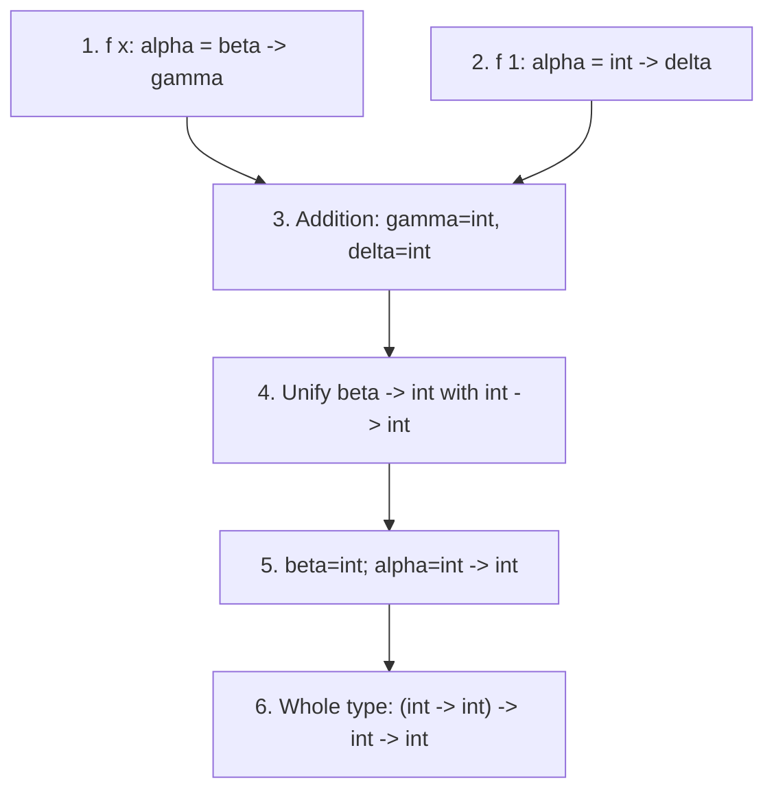

## 8.4 Read a typing rule as premises to establish

Source: [PDF pp. 232–242](https://prl.korea.ac.kr/courses/cose212/2026/pl-book-eng.pdf#page=232). In `Γ ⊢ e : T`, Γ supplies assumptions about free names. The judgment says a rule derivation gives e type T; it does not report an evaluation result.

Derive the type of `fun b -> if b then 1 else 2`:

1. Give b a provisional type α and enter the body under `Γ[b ↦ α]`.
2. The IF rule requires its guard to have type bool. Lookup gives α, so require α=bool.
3. Each literal branch has type int. Thus both branches meet the same-result-type requirement.
4. Conclude the conditional has type int under `Γ[b ↦ bool]`.
5. The procedure rule combines parameter type bool and result type int: the whole expression has type `bool -> int`.

If the else branch were false, the branch requirement would be `int = bool`, so the derivation would fail. Even a literal true guard does not remove that requirement in this type system.

| Claim | Meaning | What it does not claim |
|---|---|---|
| Sound typing rules | Accepted programs satisfy the stated type-safety property | Every behaviorally safe program is accepted |
| Complete inference for those rules | The algorithm finds a type whenever these rules permit one | The rules accept every program that would run without a type error |
| Successful inference here | Value shapes meet this system's constraints | Termination, a nonzero divisor, or a nonempty list |

Always ask “sound or complete **with respect to which property or rules?**” An algorithm can be complete for a deliberately conservative set of rules.

### Add a recursive function's type before checking its body

The LETREC rule in [Figure 8.4, PDF p. 238](https://prl.korea.ac.kr/courses/cose212/2026/pl-book-eng.pdf#page=238) carries a provisional function type into two different scopes. For `letrec f(x) = body in inside`:

1. Introduce fresh parameter and result types a and b.
2. Check `body` at type b under `Γ[f ↦ a→b, x ↦ a]`. Both f and x are available here.
3. Check `inside` at the requested overall type t under `Γ[f ↦ a→b]`. The parameter x is not introduced in this scope.
4. Solve both groups of constraints together; every recursive call to f shares that same a→b in this monomorphic rule.

The type environment contains a **type for f**, not a runtime closure. Waiting until the body has been checked before adding f would make its recursive occurrences appear unbound. Assigning a fresh unrelated type to each recursive call would fail to enforce this rule.

## 8.5 Translate each typing rule into equations

The PDF's Figure 8.9 on [pp. 256–258](https://prl.korea.ac.kr/courses/cose212/2026/pl-book-eng.pdf#page=256) provides the bridge from judgments to `gen_equations`. Read `V(Γ,e,t)` as “generate requirements for expression e to have the **requested** type t.” The request can contain unknowns; V does not have to know their solution yet.

Here `∧` means collect **all** the constraints, not evaluate an OCaml boolean expression. Each “fresh” type variable is new to this generation run. `Γ[x↦a]` shadows x only in the indicated recursive call.

Scroll the table sideways to read each formula and its explanation.

| Expression shape | Equations / recursive requests | Why |
|---|---|---|
| Numeral n | `t = int` | Its result is an integer |
| Variable x | `t = Γ(x)` | Every occurrence uses the current binding; an absent name is an error |
| `e₁ + e₂` | `t = int ∧ V(Γ,e₁,int) ∧ V(Γ,e₂,int)` | Constrain the result and both operands |
| `iszero e` | `t = bool ∧ V(Γ,e,int)` | Integer input, boolean result |
| `if c then a else b` | `V(Γ,c,bool) ∧ V(Γ,a,t) ∧ V(Γ,b,t)` | Both branches share the requested result type |
| `let x=a in b` | Fresh u; `V(Γ,a,u) ∧ V(Γ[x↦u],b,t)` | Type the initializer before exposing its binding to the body |
| `fun x -> body` | Fresh u,v; `t = u→v ∧ V(Γ[x↦u],body,v)` | Build an arrow and constrain its result through the body |
| `f a` | Fresh u; `V(Γ,f,u→t) ∧ V(Γ,a,u)` | Connect the argument type with the function's domain |

1. Match the outer constructor of the AST.
2. Emit equations about that constructor's own result.
3. Allocate fresh unknowns only where the row calls for them.
4. Recurse on each child using the row's environment and requested type.
5. Concatenate the equations, solve them, and apply the solution to the original root type.

**Trace `let x=1 in iszero x`, with requested root type r:**

| Recursive request | Emitted equation |
|---|---|
| Initializer 1 at fresh type u | `u = int` |
| Body `iszero x` at r, under x↦u | `r = bool` |
| The zero-test operand x at int | `int = u` |

The equations agree, and solving yields r=bool. No concrete execution of x or `iszero` occurred during inference. The small system is intentionally monomorphic; [generalizing a let scheme](#depth-8-7) is an additional operation, not something to perform at every ordinary lookup.

The table matches Figure 8.9's core cases. The starter's subtraction case uses the same integer requirements as addition, and recursive bindings use the [separate LETREC rule](#depth-8-4). The source's larger Fun extension adds further constructors and equality obligations; it is not covered by copying this table alone.

## 8.6.1 Combine constraints from two uses of the same function

Source: the equation-generation method on [PDF pp. 248–258](https://prl.korea.ac.kr/courses/cose212/2026/pl-book-eng.pdf#page=248). Unlike the earlier single-call example, this one makes one use of f constrain another.

Infer `fun f -> fun x -> f x + f 1` under the monomorphic rules. Let f have type α, x type β, and the two call results have types γ and δ.

| Syntax encountered | Equation generated | Reason |
|---|---|---|
| `f x` | `α = β -> γ` | f accepts x's type and returns γ |
| `f 1` | `α = int -> δ` | The same f accepts an integer and returns δ |
| Addition | `γ = int`, `δ = int` | Both operands of + must be integers |
| Both nested procedures | Root type `α -> β -> int` | The body is an addition |

1. Substitute γ=int and δ=int into the two equations for α.
2. Compare `β -> int` with `int -> int`.
3. Decompose the function types: β=int, with the result equation already satisfied.
4. Replace α with `int -> int` and β with int in the root type.
5. Report `(int -> int) -> int -> int`.

Giving each occurrence of this parameter f an unrelated fresh type would miss the connection. Freshness belongs to newly introduced unknowns and to instantiating quantified schemes, not arbitrary repetitions of a monomorphic variable.

## 8.6.2 Keep the equation worklist and substitution separate

Source: [PDF pp. 259–270](https://prl.korea.ac.kr/courses/cose212/2026/pl-book-eng.pdf#page=259). Solve `α -> β = int -> α` without guessing:

| Step | Equation being handled | Remaining work | Accumulated substitution |
|---|---|---|---|
| 1 | Matching arrow constructors | `α=int`, `β=α` | Empty |
| 2 | Bind α to int | `β=α` | α↦int |
| 3 | Normalize `β=α` under the substitution | `β=int` | α↦int |
| 4 | Bind β to int | Empty | α↦int, β↦int |

1. Apply the current substitution before classifying an equation.
2. Remove identical sides, or decompose matching compound types.
3. Before binding a variable, perform the occurs check on the normalized other side.
4. Propagate the new binding through remaining equations and existing substitution entries, or use an equivalent recursively normalized representation.
5. Apply the final substitution to the original requested type.

For `α=β` followed by `β=α -> int`, normalization exposes `β=β -> int`; reject it. Checking only the raw second equation can miss this indirect cycle. For the PDF's substitution examples, descend into **both** sides of every arrow; replacing only the outermost type variable leaves hidden unknowns unchanged.

## 8.7 Instantiate only the variables quantified by a scheme

Source: [PDF pp. 271–274](https://prl.korea.ac.kr/courses/cose212/2026/pl-book-eng.pdf#page=271). A monotype such as `α -> α` and a scheme `∀α. α -> α` are different objects.

1. Infer the type of `let id = fun x -> x` and solve the constraints for its definition.
2. Apply the solution to the surrounding environment as well as the inferred type.
3. Generalize only independent variables: `FTV(type) − FTV(environment)`.
4. Store the scheme `∀α. α -> α` for this closed identity definition.
5. At `id 1`, instantiate α with fresh β, then solve β=int.
6. At `id true`, instantiate α with fresh γ, then solve γ=bool. β and γ do not need to agree.

**Why subtract the environment's variables?** Suppose Γ assigns y the unknown type β and the definition is `let k = fun x -> y`. The inferred type is `α -> β`. You may quantify α, but β belongs to the surrounding y, so the scheme is `∀α. α -> β`. Calls can accept different input types while their result type remains tied to y. Freshening β at each call would disconnect the same captured value from its type.

This explanation describes the pure let-polymorphic extension. The downloadable teaching checker remains monomorphic, and actual OCaml has additional rules, including restrictions needed when polymorphism interacts with mutable state. Do not infer an OCaml implementation simply from the formula for pure let-generalization.
