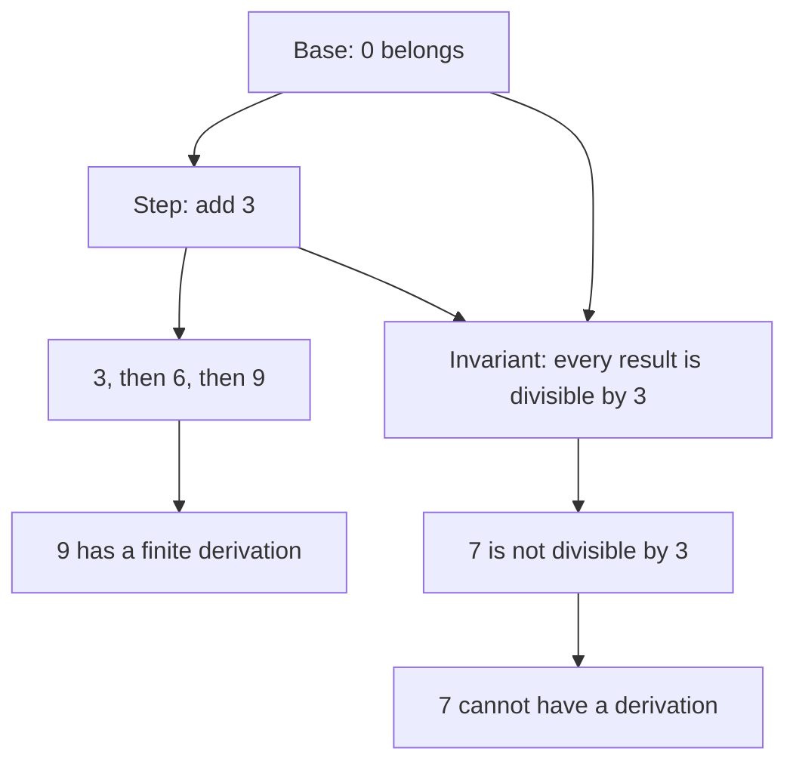
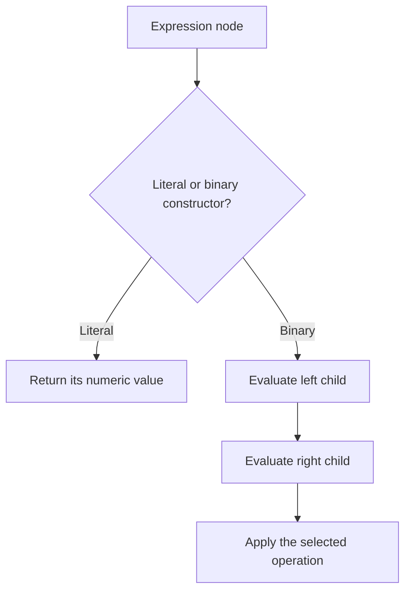
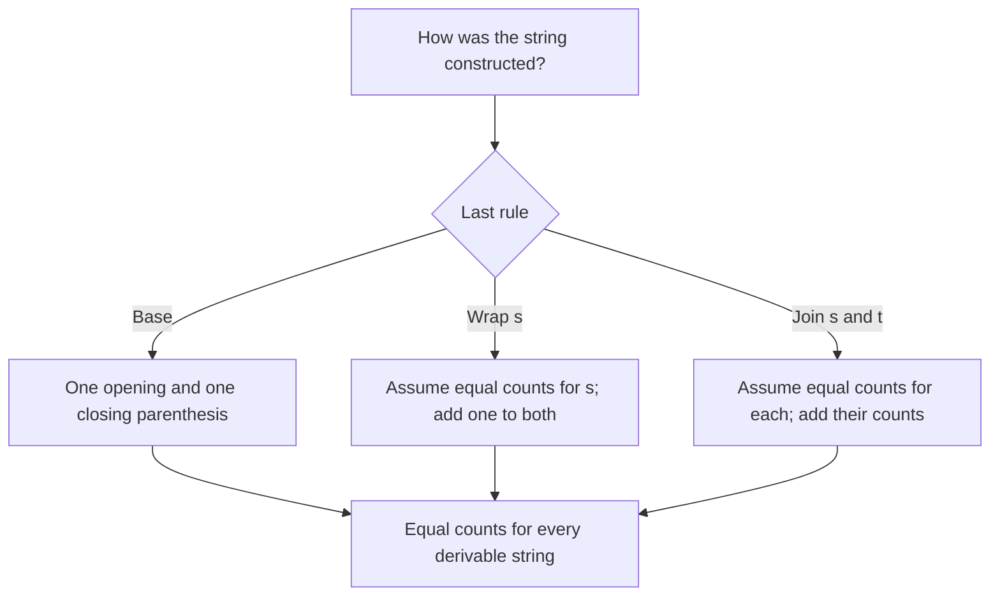

## Before you begin

**Read in the PDF:** [Chapter 1, pp. 11–32](https://prl.korea.ac.kr/courses/cose212/2026/pl-book-eng.pdf#page=11). **Goal:** understand why a finite set of rules can describe infinitely many programs. **Definitions:** [inductive definition](glossary.html#inductive-definition), [inference rule](glossary.html#inference-rule), [structural induction](glossary.html#structural-induction).

## 1.1 Inductive Definition of Sets

[Read in the PDF: p. 11](https://prl.korea.ac.kr/courses/cose212/2026/pl-book-eng.pdf#page=11).

An inductive definition provides starting elements and ways of constructing more elements from existing ones. It defines the **smallest** set closed under those rules. This last word matters: a larger set might obey the same closure conditions while containing elements that the rules never generate.

The book starts with 0 and the construction “from n, build n + 3.” Repeated construction gives 0, 3, 6, 9, and so on. Every generated number is a nonnegative multiple of three. Conversely, applying the step k times generates 3k. These two arguments establish exactly which set the rules describe.

An inference rule has premises above a line and a conclusion below. A rule with no premises is an axiom. To establish membership, construct a finite proof tree whose leaves are axioms. To refute membership, identify a property preserved by every rule; merely failing to find a derivation is not a proof of impossibility.

**A second construction:** start with `()`; wrap a constructed string in another pair; or concatenate two constructed strings. The book's rules generate nonempty balanced-parenthesis strings. Do not silently add the empty string: a base rule for it would change the defined set. Wrapping `()()` produces `(()())`; concatenation and wrapping are different constructors.

**Worked reasoning check:** why can the set of all natural numbers not be the answer to the first definition? It is closed under the rules but is not smallest: it contains 1, which has no derivation from 0 by adding three.

## 1.2 Inductive Definition of Programming Languages

[Read in the PDF: p. 22](https://prl.korea.ac.kr/courses/cose212/2026/pl-book-eng.pdf#page=22).

A grammar uses the same idea to construct expressions. Numeric literals are base expressions. A binary operation constructs an expression from two expressions. This yields a finite abstract syntax tree even when the set of possible programs is infinite.

Separate three questions: **syntax** asks whether a tree is well formed; **semantics** asks what that tree means; **implementation** asks how to compute that meaning. The syntax constructor for addition does not itself perform addition. Its evaluator must recursively compute both operands and combine their values.

For a tree representing `(1 + 2) * (3 / 3)`, the two immediate children evaluate to 3 and 1, so the root evaluates to 3. The proof follows the tree; it does not scan tokens from left to right. Division also illustrates a semantic side condition: a syntactically valid expression may have no result when its denominator is zero.

**Connection:** [HW1 P12](hw1.html#p12-formulas-and-arithmetic) and the later interpreter assignments all follow this “one constructor, one case” organization.

## 1.3 Inductive Proof

[Read in the PDF: p. 28](https://prl.korea.ac.kr/courses/cose212/2026/pl-book-eng.pdf#page=28).

Structural induction is the proof counterpart of structural recursion. Prove the property for each base constructor. For each recursive constructor, assume it for its immediate inputs and prove it for the constructed output. An induction hypothesis is permission to use a fact about smaller components, not permission to assume the desired conclusion.

### Worked example: divisibility

For the rules with base 3 and binary addition, the base is divisible by three. In the addition case, the hypotheses give `x = 3a` and `y = 3b`; hence `x + y = 3(a + b)`. Both rule cases preserve divisibility, so every derivable element is divisible by three. Notice this is a different rule set from §1.1's base-0 example.

### Worked example: balanced parentheses

Let `L(s)` and `R(s)` count opening and closing parentheses. Prove `L(s) = R(s)` for every generated string:

1. **Base `()`:** both counts are 1.
2. **Wrap `(s)`:** both counts increase by 1. The hypothesis `L(s) = R(s)` therefore gives equal new counts.
3. **Concatenate `st`:** `L(st) = L(s) + L(t) = R(s) + R(t) = R(st)`, using both hypotheses.

**Limit of the result:** equal counts alone do not imply balanced order; `)(` has equal counts and is not generated. The proof establishes a necessary property, not a complete membership test.

### From proof to program

To prove `length (append xs ys) = length xs + length ys`, induct on `xs`. For `[]`, append returns `ys`. For `h::t`, append returns `h::append t ys`; add one to the induction hypothesis for `t`. This original practice example uses the same proof shape you will implement in Chapter 2.

**Ready to continue when:** you can name the base cases, recursive cases, and induction hypothesis without first writing code. Next: [Chapter 2](textbook-02.html).
