## How to use these solutions

These are the **textbook's §2.4 Problems 1–12**, not HW1's different problem list. Read the paraphrased task, follow the Mermaid flow, and try writing the code before opening the worked solution. [Return to Chapter 2](textbook-02.html#2-4-exercises).

[Download the complete OCaml solutions and checks](examples/textbook_exercises.ml). Every implementation below is included in that file. Helpers for differentiation and both fold versions of all five Problem 10 functions are also included. Solutions assume arithmetic results fit OCaml's integer range.

**Before opening a solution:** read its **Interface**, **Before you code**, and **Check your result** lines. They state the requested function shape, link to the needed chapter idea, and give an observable target. A type variable such as `'a` stands for an element type; repeated occurrences must agree. `a -> b -> c` takes successive arguments, while `a * b -> c` takes one pair. Each problem's numbered thinking steps describe how to derive the answer.

## Problem 1 — Inclusive range

**Source:** [p. 89](https://prl.korea.ac.kr/courses/cose212/2026/pl-book-eng.pdf#page=89). **Task:** construct the integers from n through m, inclusive. **Key idea:** a smaller interval. **Related homework:** [HW1 guide](hw1.html).

**Interface:** `range : int -> int -> int list`. The PDF assumes n ≤ m.

**Before you code:** review [recursive contracts and decreasing inputs](textbook-02.html#depth-2-2). **Check your result:** `range 3 7` contains both endpoints and exactly five integers; equal endpoints produce a singleton.

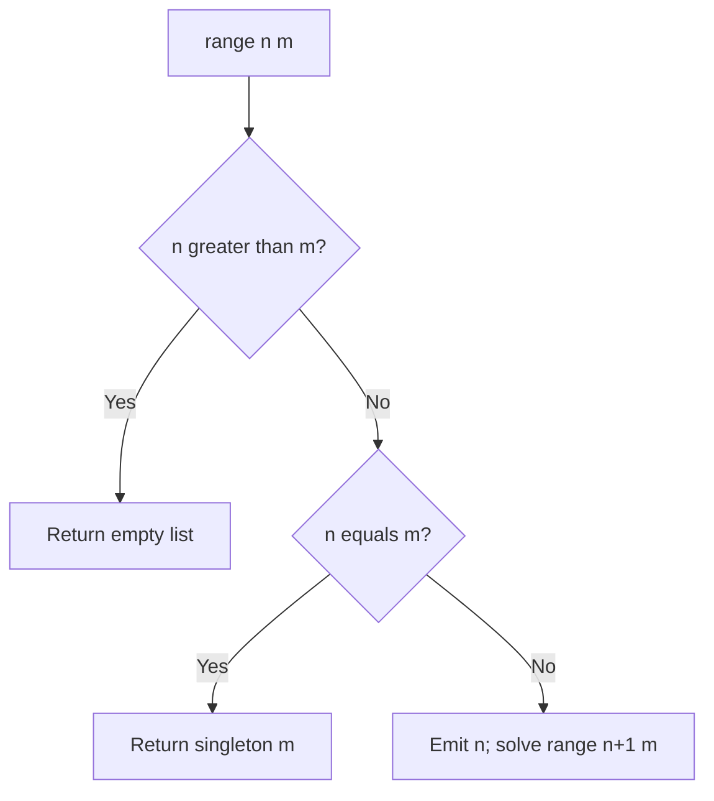

<details class="worked-solution"><summary>Worked solution and trace</summary>

```ocaml
let rec range n m =
  if n > m then []
  else if n = m then [m]
  else n :: range (n + 1) m
```

For `range 3 5`, expand `3 :: (4 :: [5])`. The interval length decreases each time. The singleton branch avoids computing `max_int + 1` at the last endpoint. The book assumes `n <= m`; returning `[]` for a reversed interval is an explicit extension. Time and output space are linear in the interval length; this direct version also uses linear call-stack space.

</details>

## Problem 2 — Flatten one list level

**Source:** [p. 90](https://prl.korea.ac.kr/courses/cose212/2026/pl-book-eng.pdf#page=90). **Task:** concatenate a list of lists in order. **Key idea:** replace each outer list constructor with append, not cons.

**Interface:** `concat : 'a list list -> 'a list`.

**Before you code:** review [lists, cons, and append](syntax.html#list) and [fold choice](textbook-02.html#depth-2-3). **Check your result:** the outer nesting disappears once, while every element keeps its original order. `[[1;2];[];[3]]` gives `[1;2;3]`.

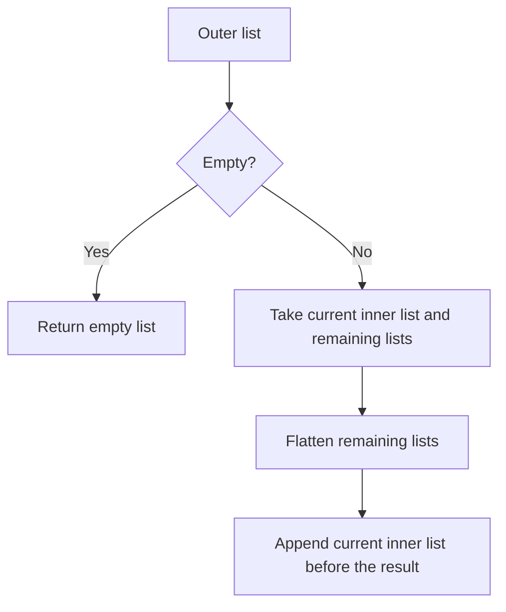

<details class="worked-solution"><summary>Worked solution and trace</summary>

```ocaml
let concat xs = List.fold_right (@) xs []
```

For `[[1;2]; []; [3]]`, the expansion is `[1;2] @ ([] @ ([3] @ []))`. Empty inner lists contribute nothing. Using `::` would retain nesting. Each inner list is copied once by append, giving time linear in the total number of elements plus the outer list length. Test an empty outer list and several empty inner lists.

</details>

## Problem 3 — Interleave two lists

**Source:** [p. 90](https://prl.korea.ac.kr/courses/cose212/2026/pl-book-eng.pdf#page=90). **Task:** alternate elements, starting with the first list, then retain the unmatched suffix. This is not a function that builds a list of pairs.

**Interface:** `zipper : int list -> int list -> int list`, as requested by the PDF. The worked implementation also supports other common element types.

**Before you code:** review [pattern matching on data shapes](textbook-02.html#depth-2-1). **Check your result:** `[1;3]` interleaved with `[2;4;6]` gives `[1;2;3;4;6]`; neither input loses its leftover elements.

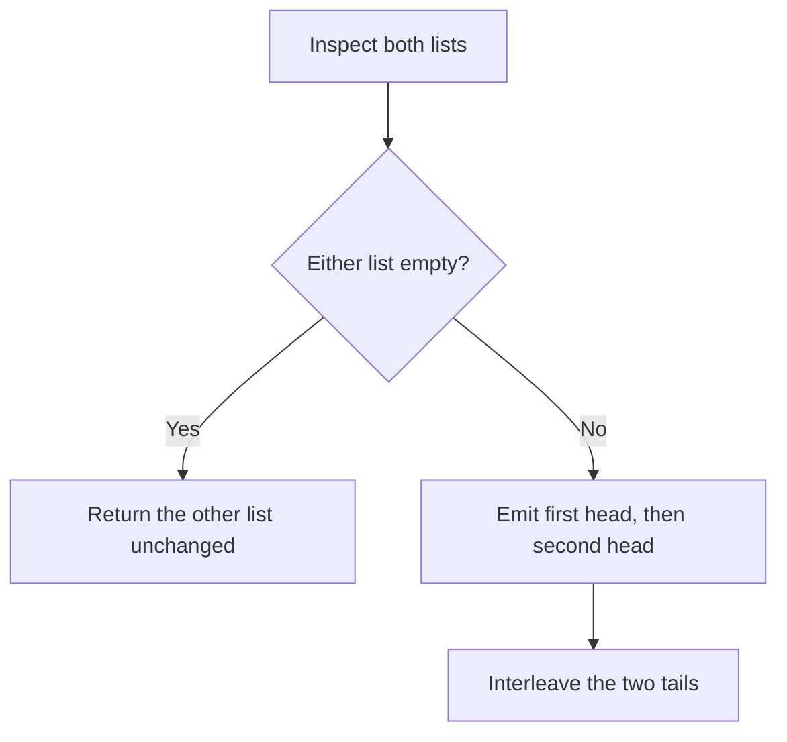

<details class="worked-solution"><summary>Worked solution and trace</summary>

```ocaml
let rec zipper xs ys = match xs, ys with
  | [], rest | rest, [] -> rest
  | x::xt, y::yt -> x :: y :: zipper xt yt
```

`zipper [1;3] [2;4;6]` emits 1, 2, then 3, 4, then shares the remaining `[6]`. Each recursive call consumes one element from both lists. Check each list empty separately, and each unequal-length direction. The implementation is polymorphic, which includes the integer-list type requested by the book.

</details>

## Problem 4 — Unzip pairs

**Source:** [pp. 90–91](https://prl.korea.ac.kr/courses/cose212/2026/pl-book-eng.pdf#page=90). **Task:** separate first and second components while preserving order. **Key idea:** the recursive answer is itself a pair.

**Interface:** `unzip : ('a * 'b) list -> 'a list * 'b list`.

**Before you code:** review [tuples versus lists](textbook-02.html#depth-2-1). **Check your result:** `[(1,"a");(2,"b")]` gives `([1;2],["a";"b"])`. Both output lists have the input's length, but their element types may differ.

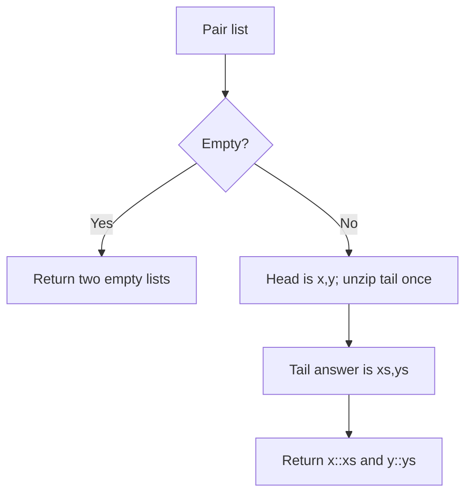

<details class="worked-solution"><summary>Worked solution and trace</summary>

```ocaml
let rec unzip = function
  | [] -> [], []
  | (x,y)::rest -> let xs,ys = unzip rest in x::xs, y::ys
```

For `[(1,"a"); (2,"b")]`, the tail gives `([2],["b"])`; prepend 1 and `"a"`. The result has type `'a list * 'b list`, and the two lists need not share an element type. Calling `unzip rest` twice would duplicate work. Time is linear; the induction hypothesis states both output lists already preserve the tail's component order.

</details>

## Problem 5 — Drop a prefix

**Source:** [p. 91](https://prl.korea.ac.kr/courses/cose212/2026/pl-book-eng.pdf#page=91). **Task:** remove n leading elements, returning empty if the list runs out.

**Interface:** `drop : 'a list -> int -> 'a list` — list first, count second.

**Before you code:** review [counting down along a list](textbook-02.html#depth-2-2). **Check your result:** dropping 0 returns the original list; dropping more elements than exist returns `[]`. Negative counts are not specified by the PDF; the solution below documents its extension.

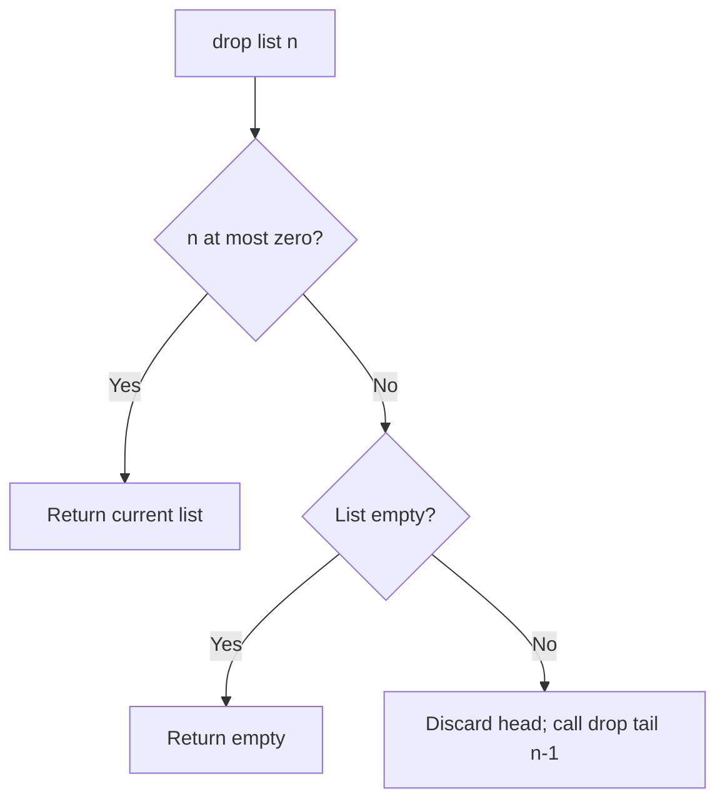

<details class="worked-solution"><summary>Worked solution and trace</summary>

```ocaml
let rec drop xs n =
  if n <= 0 then xs
  else match xs with [] -> [] | _::rest -> drop rest (n-1)
```

`drop [1;2;3] 2` becomes `drop [2;3] 1`, then `drop [3] 0`, giving `[3]`. No output rebuilding is needed: the answer is an existing suffix. Negative n is unspecified in the problem; this solution treats it as zero. The call is tail recursive and visits at most `min(n, length xs)` nodes for nonnegative n.

</details>

## Problem 6 — Generalized summation

**Source:** [pp. 91–92](https://prl.korea.ac.kr/courses/cose212/2026/pl-book-eng.pdf#page=91). **Task:** sum f(i) over an inclusive interval. **Key idea:** parameterize the contribution, keep the traversal.

**Interface:** `sigma : (int -> int) -> int -> int -> int`.

**Before you code:** review [functions as arguments](textbook-02.html#depth-2-3) and [Problem 1's interval](#problem-1-inclusive-range). **Check your result:** summing the identity function from 1 through 10 gives 55; a one-point interval contributes exactly one call to f.

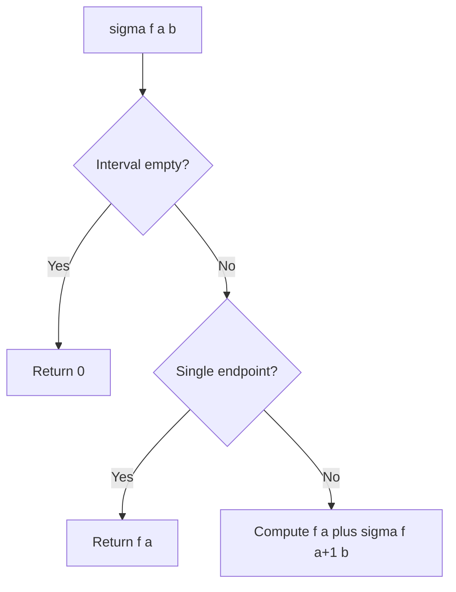

<details class="worked-solution"><summary>Worked solution and trace</summary>

```ocaml
let rec sigma f a b =
  if a > b then 0
  else if a = b then f a
  else f a + sigma f (a+1) b
```

For the square function on 1 through 3, the contributions are 1, 4, 9, so the answer is 14. The empty-sum identity is 0. The function is called once per integer, assuming mathematical, side-effect-free f; this expression does not prescribe an effect order for OCaml's `+` operands. Use explicit `let` bindings if effect order matters. Boundary checks include equal endpoints and an empty interval.

</details>

## Problem 7 — Repeated function application

**Source:** [p. 92](https://prl.korea.ac.kr/courses/cose212/2026/pl-book-eng.pdf#page=92). **Task:** return a function that applies f exactly n times. **Key idea:** zero repetitions means the identity function, not the number zero.

**Interface:** `iter : int * (int -> int) -> (int -> int)` — its first argument is a pair, and its result is a function.

**Before you code:** review [application and function types](textbook-02.html#application-arrows-and-scope). **Check your result:** `iter (0,f)` must return its eventual argument unchanged without calling f. Only nonnegative repetition counts are specified.

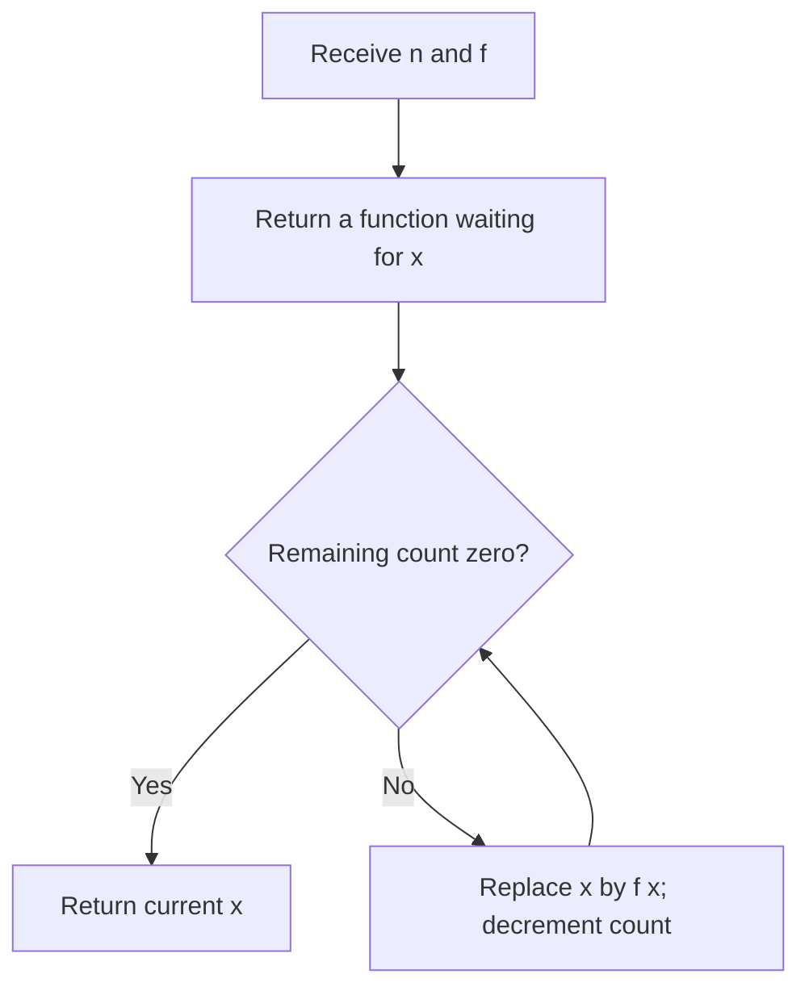

<details class="worked-solution"><summary>Worked solution and trace</summary>

```ocaml
let iter (n,f) =
  if n < 0 then invalid_arg "iter: negative count";
  let rec apply n x = if n = 0 then x else apply (n-1) (f x) in
  apply n
```

For `iter (3, fun x -> x+2) 0`, the carried values are 0, 2, 4, 6. Constructing `iter (3,f)` returns a function; it does not immediately call f. Test n = 0 with a function that would fail if called. Negative repetition is rejected because the problem only defines zero and positive counts. The returned function uses tail recursion.

</details>

## Problem 8 — Universal predicate with a right fold

**Source:** [p. 93](https://prl.korea.ac.kr/courses/cose212/2026/pl-book-eng.pdf#page=93). **Task:** all elements must satisfy p; use `fold_right`.

**Interface:** `all : ('a -> bool) -> 'a list -> bool`. The right-fold requirement is part of the task.

**Before you code:** review [fold accumulator types and grouping](textbook-02.html#depth-2-3). **Check your result:** empty input is true; a single counterexample makes the result false. Keep the correct result separate from whether the traversal stops early.

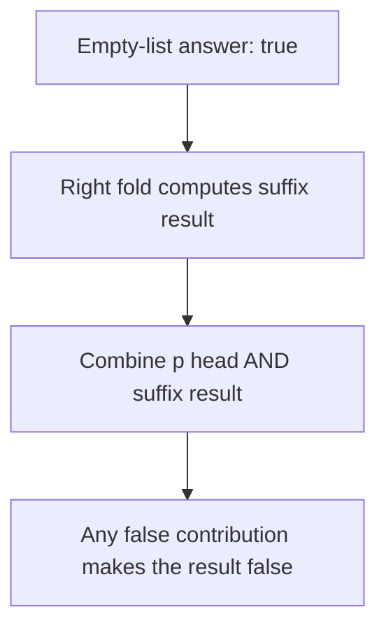

<details class="worked-solution"><summary>Worked solution and trace</summary>

```ocaml
let all p xs = List.fold_right (fun x rest -> p x && rest) xs true
```

For `[7;8;9]` and `p x = x > 5`, the logical expression is `true && (true && (true && true))`. The empty list returns true because there is no counterexample. OCaml evaluates the folded suffix before applying the combining function, so this satisfies the fold requirement but is not an early-stopping traversal. Test empty input and a failure near either end.

</details>

## Problem 9 — Digits to a number

**Source:** [p. 93](https://prl.korea.ac.kr/courses/cose212/2026/pl-book-eng.pdf#page=93). **Task:** read decimal digits with `fold_left`. **Invariant:** the accumulator is the number represented by the processed prefix.

**Interface:** `lst2int : int list -> int`. Every input element is assumed to be a digit from 0 through 9.

**Before you code:** review [the prefix-accumulator meaning of a left fold](textbook-02.html#depth-2-3). **Check your result:** `[1;2;3]` means 123, while `[0;4]` means 4; the order of digits matters.

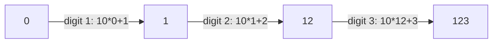

<details class="worked-solution"><summary>Worked solution and checks</summary>

```ocaml
let lst2int xs = List.fold_left (fun acc digit -> 10*acc+digit) 0 xs
```

Multiplication by ten shifts existing digits left by one decimal place; addition installs the new units digit. Empty input gives 0 and leading zeros have no effect. The book assumes each element is between 0 and 9; validation is therefore not part of the required algorithm. Test `[0;4]`, `[0]`, and `[]`. Very long inputs can overflow OCaml integers.

</details>

## Problem 10 — Rewrite five functions with folds

**Source:** [pp. 93–94](https://prl.korea.ac.kr/courses/cose212/2026/pl-book-eng.pdf#page=93). **Task:** length, reverse, positive-element check, map, and filter. The wording mentions both folds; the downloadable solution supplies **both versions of all five**.

**Interface:** preserve each original function's arguments and result:

| Subpart | Requested function type | Required meaning |
|---|---|---|
| 1 · length | `'a list -> int` | Count elements |
| 2 · reverse | `'a list -> 'a list` | Reverse their order |
| 3 · is_all_pos | `int list -> bool` | True exactly when every element is positive |
| 4 · map | `('a -> 'b) -> 'a list -> 'b list` | Transform each element in its original position |
| 5 · filter | `('a -> bool) -> 'a list -> 'a list` | Keep matching elements in their original order |

**Before you code:** review [map, filter, and both fold signatures](textbook-02.html#depth-2-3). **Check your result:** test all five functions on empty and mixed-sign lists; map and filter must preserve order. The download uses `_r` and `_l` suffixes so both implementations can coexist.

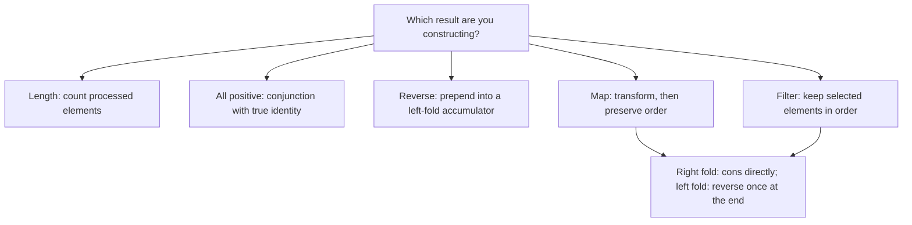

<details class="worked-solution"><summary>All five solutions and why order matters</summary>

| Function | Right-fold solution | Left-fold solution |
|---|---|---|
| Length | `List.fold_right (fun _ n -> n+1) xs 0` | `List.fold_left (fun n _ -> n+1) 0 xs` |
| Reverse | `List.fold_right (fun x rest -> rest @ [x]) xs []` | `List.fold_left (fun rest x -> x::rest) [] xs` |
| All positive | `List.fold_right (fun x rest -> x>0 && rest) xs true` | `List.fold_left (fun rest x -> rest && x>0) true xs` |
| Map f | `List.fold_right (fun x rest -> f x::rest) xs []` | `List.rev (List.fold_left (fun rest x -> f x::rest) [] xs)` |
| Filter p | `List.fold_right (fun x rest -> if p x then x::rest else rest) xs []` | `List.rev (List.fold_left (fun rest x -> if p x then x::rest else rest) [] xs)` |

For mapping increment over `[1;2;3]`, the left fold builds `[4;3;2]`, then `List.rev` restores `[2;3;4]`. That final reversal is essential. The direct right-fold reverse uses repeated append and is quadratic; the left-fold reverse is linear. These are value-equivalent for pure f and p; side-effect order can differ between fold directions.

**Checks:** empty input, singleton input, and `[3;0;-2;4]` distinguish order and predicate mistakes. The solution file compares every version to the corresponding standard-library behavior.

</details>

## Problem 11 — Peano addition and multiplication

**Source:** [pp. 94–95](https://prl.korea.ac.kr/courses/cose212/2026/pl-book-eng.pdf#page=94). **Task:** arithmetic on `ZERO | SUCC of nat`. **Definitions:** inductive definition and structural recursion.

**Interface:** `natadd : nat -> nat -> nat` and `natmul : nat -> nat -> nat`, with `type nat = ZERO | SUCC of nat`.

**Before you code:** review [constructor-based induction](textbook-01.html#depth-1-3). **Check your result:** return a `nat` tree rather than a host integer; ZERO must obey the identities for addition and multiplication. `SUCC (SUCC ZERO)` represents 2, so count constructors to check small examples.

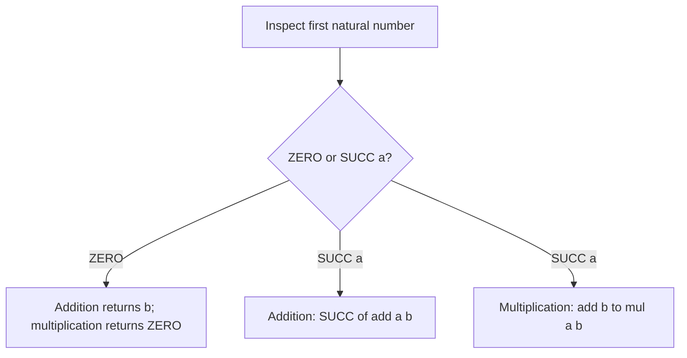

<details class="worked-solution"><summary>Worked solution and proof idea</summary>

```ocaml
type nat = ZERO | SUCC of nat
let rec natadd a b = match a with
  | ZERO -> b
  | SUCC a' -> SUCC (natadd a' b)
let rec natmul a b = match a with
  | ZERO -> ZERO
  | SUCC a' -> natadd b (natmul a' b)
```

Interpret the equations mathematically: `0+b=b`, `(a+1)+b=1+(a+b)`, `0*b=0`, and `(a+1)*b=b+a*b`. For 2 times 3, multiplication expands to 3 plus (3 plus 0). Induction on the first argument proves both definitions correct; multiplication uses the already-established addition result. Check zero in either argument, one, and the book's 2/3 example.

</details>

## Problem 12 — Symbolic differentiation

**Source:** [pp. 95–96](https://prl.korea.ac.kr/courses/cose212/2026/pl-book-eng.pdf#page=95). **Task:** differentiate a syntax tree with respect to a named variable. **Key distinction:** return another expression tree, not the value of the derivative at a chosen number.

**Interface:** `diff : aexp * string -> aexp`. It takes **one pair** `(expression, variable_name)`.

**Before you code:** review [syntax trees versus computed results](textbook-01.html#depth-1-2) and [datatype pattern matching](textbook-02.html#depth-2-1). **Check your result:** `x² + 2x + 1` should become an expression representing `2x + 2`; differentiating with respect to another name must use that name consistently.

### Read the input datatype first

The datatype from the task is:

```ocaml
type aexp =
  | Const of int
  | Var of string
  | Power of string * int
  | Times of aexp list
  | Sum of aexp list
```

| Constructor | Mathematical meaning | Contents to inspect |
|---|---|---|
| `Const n` | A constant | One integer |
| `Var x` | The variable named x | One string, compared with the differentiation variable |
| `Power (x,n)` | x raised to exponent n | A variable name and exponent; the base is not an arbitrary subtree |
| `Times factors` | Product of the factors | A list of expression trees, potentially more than two |
| `Sum terms` | Sum of the terms | A list of expression trees |

For the PDF's example, `Sum [Power ("x",2); Times [Const 2; Var "x"]; Const 1]` has this shape:

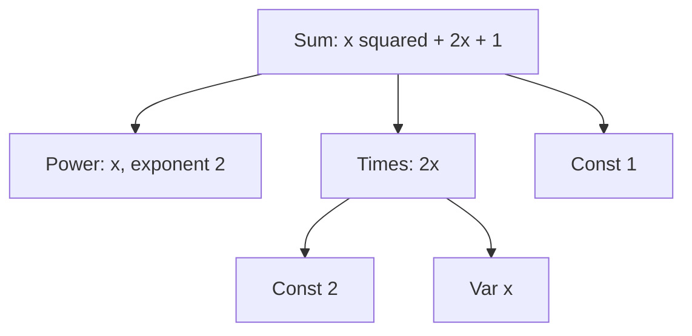

1. Match the outer Sum and process its three children.
2. Apply the power rule to the first child and the product rule to the second.
3. The last child is a constant, so it contributes zero.
4. Construct the derivative AST; simplify neutral terms to obtain the displayed answer. The worked solution's empty-sum and empty-product conventions are stated below.

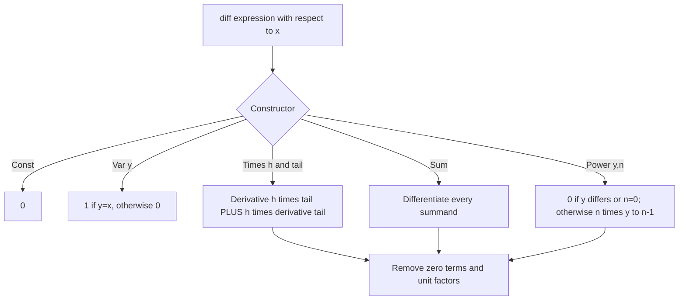

<details class="worked-solution"><summary>Worked solution, product rule, and simplification</summary>

```ocaml
let rec diff (e,x) = match e with
  | Const _ -> Const 0
  | Var y -> Const (if x = y then 1 else 0)
  | Power (y,n) ->
      if x <> y || n = 0 then Const 0
      else product [Const n; power y (n-1)]
  | Sum es -> sum (List.map (fun e -> diff (e,x)) es)
  | Times [] -> Const 0
  | Times (h::t) ->
      sum [product [diff (h,x); product t];
           product [h; diff (Times t,x)]]
```

The complete file defines `sum`, `product`, and `power` as smart constructors: remove zero summands, eliminate unit factors, turn an empty sum into 0 and an empty product into 1, and represent powers 0 and 1 directly. This gives the book's displayed simplified answer for `x² + 2x + 1`: `2x + 2`.

<details class="worked-solution"><summary>Show the helper definitions used by diff</summary>

These helpers, together with the datatype above, make the displayed `diff` function runnable. Empty Sum and Times lists use the conventional identities 0 and 1; the PDF's example does not itself specify these boundary cases. This is a small simplifier, not a canonical polynomial normalizer.

```ocaml
let sum terms =
  let terms = List.filter (function Const 0 -> false | _ -> true) terms in
  match terms with [] -> Const 0 | [x] -> x | _ -> Sum terms

let product terms =
  if List.exists (function Const 0 -> true | _ -> false) terms then Const 0
  else let terms = List.filter (function Const 1 -> false | _ -> true) terms in
    match terms with [] -> Const 1 | [x] -> x | _ -> Times terms

let power x n =
  if n = 0 then Const 1 else if n = 1 then Var x else Power (x,n)
```

Define the helpers **before** `diff` in the `.ml` file. `power "x" 1` returns `Var "x"`; `product [Const 1; Var "x"]` removes the unit factor. Neither example executes the variable x or needs a value for it.

</details>

For three factors, the recursive rule expands to `h'uv + h(u'v + uv')`. Each term differentiates exactly one factor. Differentiating every factor in one product would incorrectly give `h'u'v'`.

**Boundary cases:** the derivative of `Power("x",0)` is 0 without constructing a negative power; another variable contributes 0; the empty product denotes 1 and therefore differentiates to 0. The polynomial interpretation uses nonnegative powers. Negative exponents require a rational-function domain and restrictions at zero, beyond these checks.

The test file checks the exact book example and evaluates the derived tree for `x*x*x` at several integers against `3*x*x`. A numerically correct tree may have a different syntactic shape from the book's example; algebraic equivalence and exact constructor equality are different requirements.

</details>

## Connect this exercise set to the rest of the book

Problems 1–7 establish recursive traversal and function values. Problems 8–10 make traversal reusable. Problem 11 follows a datatype's constructors exactly. Problem 12 transforms one syntax tree into another. The same pattern becomes an **interpreter** in Chapters 3–7, a **type analyzer** in Chapter 8, and a **translator** in Chapter 9.

[Continue to Chapter 3](textbook-03.html).
