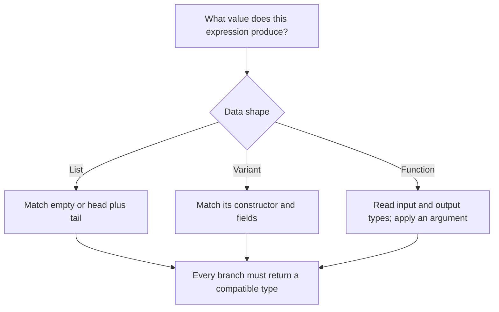
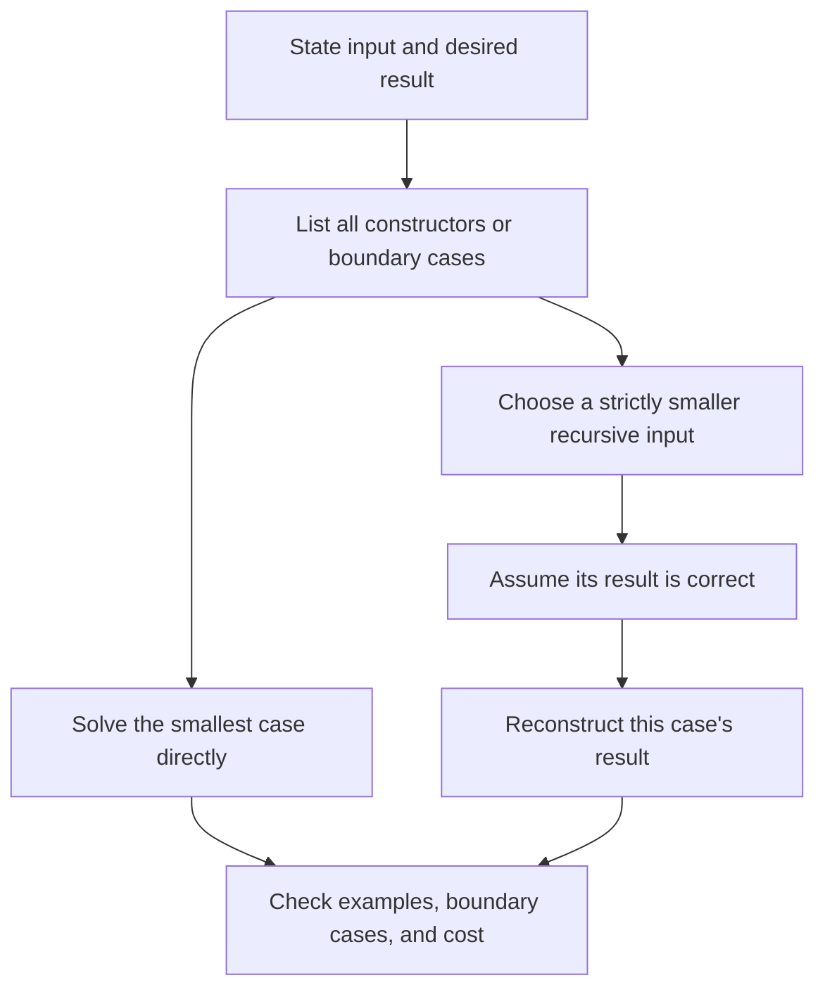
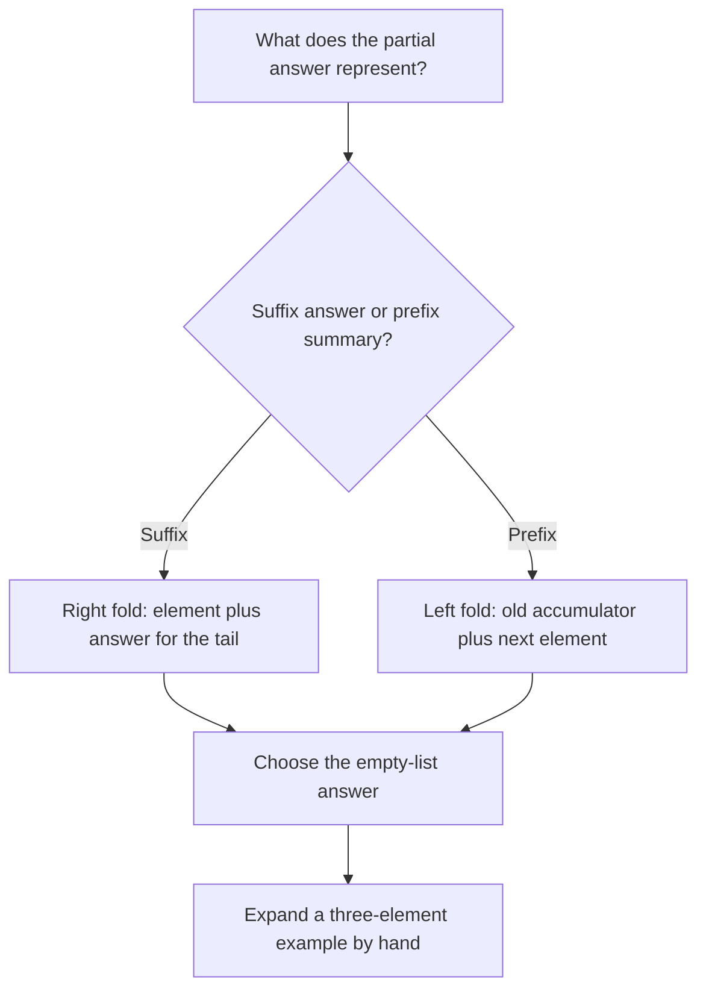

## Before you begin

**Read in the PDF:** [Chapter 2, pp. 33–96](https://prl.korea.ac.kr/courses/cose212/2026/pl-book-eng.pdf#page=33). **Goal:** use OCaml as a language for describing and processing program trees. **Definitions:** [pattern matching](glossary.html#pattern-matching), [structural recursion](glossary.html#structural-recursion), [higher-order function](glossary.html#higher-order-function).

## 2.1 OCaml Basics

[Read in the PDF: p. 34](https://prl.korea.ac.kr/courses/cose212/2026/pl-book-eng.pdf#page=34).

OCaml programs compute with expressions. A binding `let x = e1 in e2` evaluates `e1`, binds its result to `x`, and evaluates `e2` in that scope. A later binding with the same name shadows the earlier one; it does not mutate it. This distinction becomes the central subject of Chapters 3 and 6.

Types describe which operations are appropriate. Integers and floating-point numbers have distinct operations. A tuple can combine components of different types; a list has one element type. A function type `int -> int -> int` describes a function returning another function, so `add 3` can be passed around before its second argument is supplied.

```ocaml
let add x y = x + y
let add_three = add 3
let answer = add_three 4  (* 7 *)

type tree = Leaf | Node of int * tree * tree
let rec size = function
  | Leaf -> 0
  | Node (_, left, right) -> 1 + size left + size right
```

The datatype defines legal tree shapes. Pattern matching selects a constructor and names its components. In the `Node` case, `left` and `right` are structurally smaller trees, giving both a recursive program and the outline of its termination argument.



**Read this carefully:** `::` adds one element to the front of a list; `@` concatenates two lists. Thus `1 :: [2;3]` is valid, while `[1] :: [2;3]` mixes a list element with integer elements. The corresponding valid concatenation is `[1] @ [2;3]`.

Exceptions interrupt normal evaluation and can be handled with `try ... with`. References introduce mutable cells, but most of this chapter's exercises need only immutable values and recursion. See [the OCaml workbench](setup.html) for the course environment and commands.

## 2.2 Recursive Functions

[Read in the PDF: p. 70](https://prl.korea.ac.kr/courses/cose212/2026/pl-book-eng.pdf#page=70).

First write the input/output contract, then split by data constructors. In each recursive branch, identify what becomes smaller. Finally explain how the smaller answer becomes the current answer. Do not use recursion merely because the function calls itself; use it because the data has a recursive structure.

For list append, an empty left list contributes nothing. A nonempty left list contributes its head and recursively appends its tail. The right list does not need to shrink because recursion measures the left list's length.

```ocaml
let rec append xs ys = match xs with
  | [] -> ys
  | x :: rest -> x :: append rest ys
```

For reversal, the direct equation is `reverse (x::xs) = reverse xs @ [x]`. It is easy to justify, but repeated append makes it quadratic. A tail-recursive version carries a reversed prefix in an accumulator:

```ocaml
let reverse xs =
  let rec loop acc = function
    | [] -> acc
    | x :: rest -> loop (x :: acc) rest
  in loop [] xs
```

**Invariant:** `reverse original = reverse remaining @ acc`. When `remaining` is empty, `acc` is the answer. The invariant explains why moving a head into the accumulator is valid and why no work remains after the recursive call.



The chapter's examples of removing elements, insertion sort, and merging use the same method. In insertion sort, insert a head into the recursively sorted tail; the supporting invariant is that insertion preserves sortedness and adds exactly one occurrence of the new element.

## 2.3 Higher-Order Functions

[Read in the PDF: p. 81](https://prl.korea.ac.kr/courses/cose212/2026/pl-book-eng.pdf#page=81).

A higher-order function accepts or returns another function. `map` keeps a list's shape while changing each element. `filter` retains selected elements. A fold replaces a list's constructors with a combining function and a base value.

```text
fold_right f [a;b;c] z = f a (f b (f c z))
fold_left  f z [a;b;c] = f (f (f z a) b) c
```

These parenthesizations explain the result better than the phrases “right to left” and “left to right” alone. With subtraction, `[1;2;3]` and initial 0 produce 2 with the right fold and -6 with the left fold. The operation is not associative.



A left fold is tail recursive, but constructing a reversed list and reversing once may be necessary to preserve the original order. Also, strict evaluation matters: a right fold computes its tail accumulator before the combining function runs. Using `&&` inside that function does not make the entire traversal short-circuit.

## 2.4 Exercises

[Read in the PDF: pp. 89–96](https://prl.korea.ac.kr/courses/cose212/2026/pl-book-eng.pdf#page=89).

The [complete exercise walkthrough](textbook-02-problems.html) covers all twelve problems, with a separate thinking diagram, solution, trace, and boundary checks for each. It follows the book's problem order: range, concat, zipper, unzip, drop, sigma, iter, all, decimal conversion, fold rewrites, Peano arithmetic, and symbolic differentiation.

[Download all runnable §2.4 solutions](examples/textbook_exercises.ml). Run `ocaml textbook_exercises.ml` from the download directory. The file checks the implementations and reports its assertion count. Ordinary OCaml integers have finite range; arithmetic solutions assume their mathematical results fit that range.

**Ready to continue when:** you can derive the recursive case from the input's constructor, and explain the meaning of a fold accumulator. Next: [Chapter 3](textbook-03.html).
