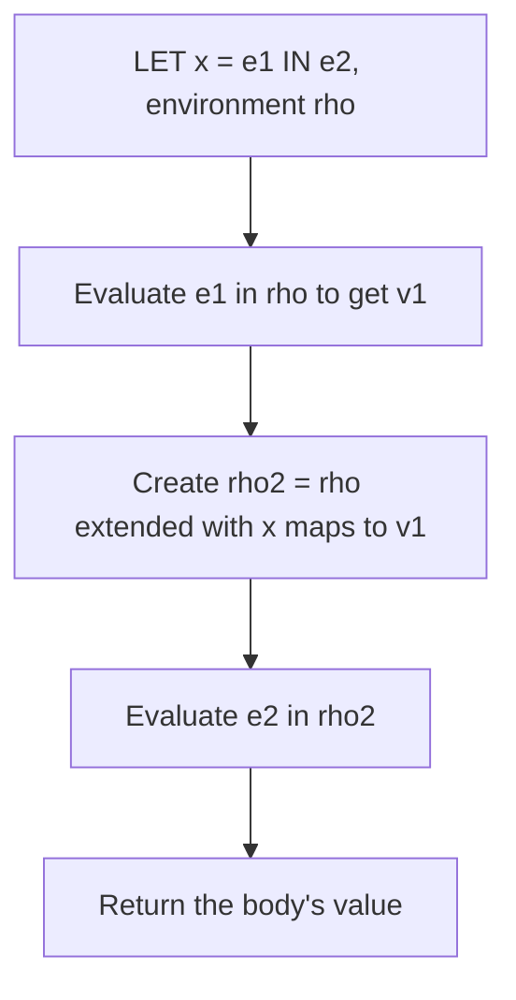
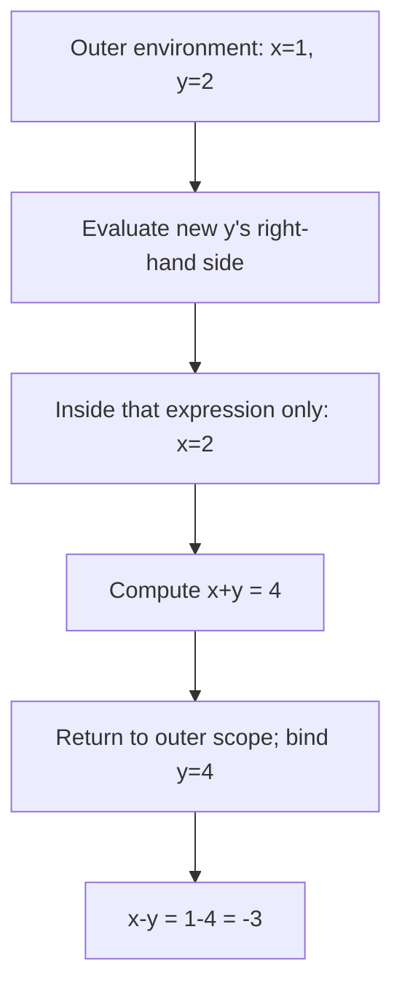

## Before you begin

**Read in the PDF:** [Chapter 3, pp. 97–117](https://prl.korea.ac.kr/courses/cose212/2026/pl-book-eng.pdf#page=97). **Goal:** turn mathematical meaning into a recursive interpreter. **Definitions:** [abstract syntax tree](glossary.html#abstract-syntax-tree), [environment](glossary.html#environment), [inference rule](glossary.html#inference-rule).

## 3.1 Syntactic Structure

[Read in the PDF: p. 97](https://prl.korea.ac.kr/courses/cose212/2026/pl-book-eng.pdf#page=97).

This language contains constants, variables, arithmetic, a zero test, conditionals, and local bindings. Each syntax form becomes an OCaml constructor. For example, `let x = 1 in x + 2` becomes `LET("x", CONST 1, ADD(VAR "x", CONST 2))`. The host language is OCaml; the tree is a program in the small language being interpreted.

An expression's outer constructor tells you which semantic rule to use. Its children correspond to that rule's premises. A variable contains a name, not its current value. The environment will supply the value during evaluation.

## 3.2 Semantic Structure

[Read in the PDF: p. 102](https://prl.korea.ac.kr/courses/cose212/2026/pl-book-eng.pdf#page=102).

The semantic domain has integer and boolean values. The judgment `ρ ⊢ e ⇒ v` says that expression e evaluates to value v in environment ρ. Read it as an input/output contract: the expression and environment are inputs; the result is a language value, represented by an OCaml variant such as `Int 3`.

An expression may be syntactically valid yet lack a derivation: adding a boolean, using an unbound name, or testing a nonboolean condition are examples. An executable interpreter reports these failures explicitly.

## 3.2.1 Environment

[Read in the PDF: p. 102](https://prl.korea.ac.kr/courses/cose212/2026/pl-book-eng.pdf#page=102).

An environment maps names to values. With an association list, the newest binding is placed first and lookup returns the first matching name. Extending an environment creates a new mapping; it does not change an older mapping used elsewhere.

```text
ρ0 = []
ρ1 = (x ↦ 1) :: ρ0
ρ2 = (x ↦ 2) :: ρ1
lookup x ρ1 = 1
lookup x ρ2 = 2
```

This is **shadowing**. The older x still exists in the outer environment but is hidden by the newer x in the inner one. It becomes visible again when evaluation returns to an expression using the outer environment.

## 3.2.2 Inference Rules

[Read in the PDF: p. 106](https://prl.korea.ac.kr/courses/cose212/2026/pl-book-eng.pdf#page=106).

For addition, evaluate both children in the same environment and require integer results. For a conditional, evaluate the condition and then exactly one branch. For `let x = e1 in e2`, evaluate e1 in the old environment, then e2 in its extension. The name x is not bound by this let inside e1.



**Trace:** `let x = 2 in let x = x + 3 in x` returns 5. The inner right-hand side reads the outer 2 before the inner binding exists. Evaluating it after extending x would implement a different rule.

## 3.3 Implementation

[Read in the PDF: pp. 114–117](https://prl.korea.ac.kr/courses/cose212/2026/pl-book-eng.pdf#page=114). This section already contains a worked interpreter in the PDF. The companion implementation below continues into Chapters 4 and 5, so you can see what changes and what stays the same.

[Download the executable interpreter and checks](examples/textbook_functional.ml). Run `ocaml textbook_functional.ml`.

The file's `eval e env` follows these rules: `CONST` returns an integer value; `VAR` looks up a name; arithmetic checks operand shapes; `LET` extends the environment; `IF` selects one branch. The unified Chapter 5 syntax uses `EQUAL(e, CONST 0)` for Chapter 3's zero test.

```ocaml
(* The essential LET branch in the complete evaluator. *)
| LET (x,a,b) ->
    let v = go a env in
    go b ((x,v)::env)
```

### Worked trace from the chapter

The nested example on p. 117 first binds x to 1 and y to 2. The right-hand side of the final y binding temporarily shadows x with 2, producing `2 + 2 = 4`. The final subtraction runs in the outer x scope, with x = 1 and the new y = 4, so it produces **-3**. The temporary x does not leak out of its own expression.



**Check the interpreter:** test an unbound name, nested shadowing, and a conditional whose unchosen branch would fail. A correct conditional must not evaluate both branches.

**Homework connection:** [HW2](hw2.html) retains these cases and extends the semantic domain. Next: [Chapter 4](textbook-04.html).
