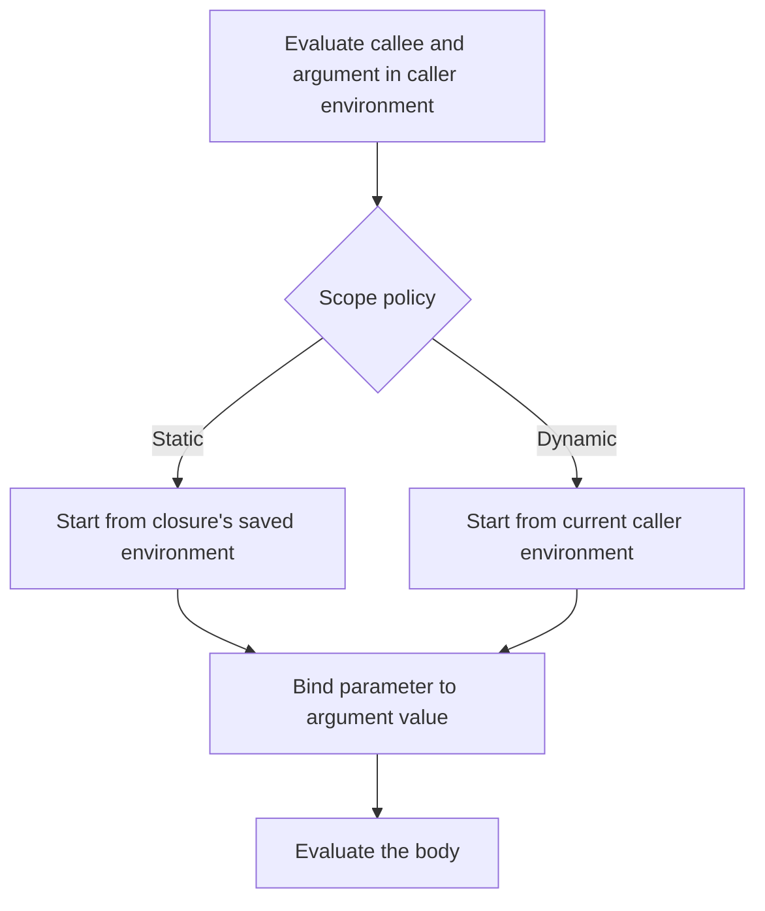
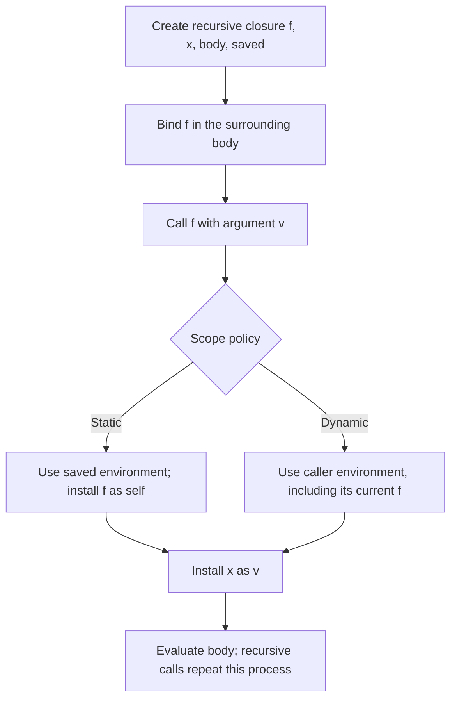

## Before you begin

**Read in the PDF:** [Chapter 4, pp. 119–145](https://prl.korea.ac.kr/courses/cose212/2026/pl-book-eng.pdf#page=119). **Goal:** decide which environment a function body should use. **Definitions:** [free variable](glossary.html#free-variable), [closure](glossary.html#closure), [lexical scope](glossary.html#lexical-scope), [dynamic scope](glossary.html#dynamic-scope).

## 4.1 Syntactic Structure

[Read in the PDF: p. 119](https://prl.korea.ac.kr/courses/cose212/2026/pl-book-eng.pdf#page=119).

`PROC(x,body)` creates a procedure and `CALL(f,arg)` applies one. A procedure is a value: it can be named, passed to another procedure, or returned. Evaluating its definition must not execute the body. The body runs when an argument is supplied.

Multiple arguments can be expressed with nested procedures: `fun x -> fun y -> x+y`. A let binding can be expressed as applying a procedure to its right-hand side, subject to the language's evaluation strategy. These are examples of syntactic sugar.

## 4.2 Semantic Structure

[Read in the PDF: p. 123](https://prl.korea.ac.kr/courses/cose212/2026/pl-book-eng.pdf#page=123).

A free variable is an occurrence not bound within the expression currently being considered. In `fun y -> x+y`, y is bound and x is free. This makes the central question precise: when the function is called, which binding supplies its free x?

Compute free variables structurally: a variable contributes itself; an operation unions its children's sets; a procedure removes its parameter; a let unions the right-hand side's set with the body's set after removing the bound name. A free variable of a subexpression can still be bound by an enclosing expression.

## 4.2.1 Static Scope

[Read in the PDF: p. 128](https://prl.korea.ac.kr/courses/cose212/2026/pl-book-eng.pdf#page=128).

Static scope uses the binding determined by the function's definition context. A closure packages `(parameter, body, saved environment)`. At a call, evaluate the callee and argument in the caller's environment, then evaluate the body in the saved environment extended with the parameter. The caller's shadowing declarations do not replace the saved ones.

## 4.2.2 Dynamic Scope

[Read in the PDF: p. 134](https://prl.korea.ac.kr/courses/cose212/2026/pl-book-eng.pdf#page=134).

Dynamic scope uses the calling environment for nonlocal names. Changing the caller can therefore change a function's meaning. The distinction is the **base environment for the body**, not whether arguments are evaluated before a call.



**Worked example, pp. 125–127:** x starts at 1; f adds x to its argument; x is shadowed with 2; g also adds x; then compute `f 1 + g 1`. Static scope gives **2 + 3 = 5**. Dynamic scope gives **3 + 3 = 6**. Draw two saved environments for the static case; do not update f's saved x when defining g.

## 4.2.3 Recursive Functions

[Read in the PDF: p. 137](https://prl.korea.ac.kr/courses/cose212/2026/pl-book-eng.pdf#page=137).

Ordinary closure creation cannot refer to a binding that has not yet been installed. A recursive closure therefore packages its own function name as well as its parameter, body, and definition environment. On static-scope application, reconstruct a body environment containing the function's own closure and the argument binding.

```text
saved environment
  + f ↦ the recursive closure itself
  + x ↦ argument value
  = environment for evaluating f's body
```

The parameter binding is the newest binding. This order matters if names coincide. In the dynamic variant, the recursive name is resolved through the calling environment. A caller that rebinds that name can therefore change the recursive call's destination; reinstalling the original function would incorrectly hide this dynamic binding.



## 4.3 Implementation

[Read in the PDF: pp. 143–145](https://prl.korea.ac.kr/courses/cose212/2026/pl-book-eng.pdf#page=143). **Task:** implement and test both static and dynamic scope.

[Download the complete solution](examples/textbook_functional.ml). `run expression` uses static scope. `eval ~scope:Dynamic expression []` uses dynamic scope. The file implements both ordinary and recursive procedure calls and verifies the 5-versus-6 example and factorial under both policies.

### Worked solution strategy

1. Add procedure variants to values before adding call branches.
2. Make `PROC` return a closure without evaluating its body.
3. In `CALL`, evaluate the function and argument exactly once.
4. Select the correct body environment using the diagram above.
5. Reinstall recursive bindings where needed, then bind the parameter.
6. Reject nonprocedure callees explicitly.

**Why factorial works:** each call gets a fresh parameter binding and the same recursive definition. The body reduces n until the zero branch returns 1; pending multiplications reconstruct the result. For n = 5, it returns 120.

**A useful failure test:** returning a procedure that mentions an outer parameter should continue to work with static scope after the outer call returns. Replacing the saved environment with the caller's environment breaks this case.

**Homework connection:** [HW2 procedures and recursion](hw2.html); [HW1 binding analysis](hw1.html#p15-free-variable-checker). Next: [Chapter 5](textbook-05.html).
