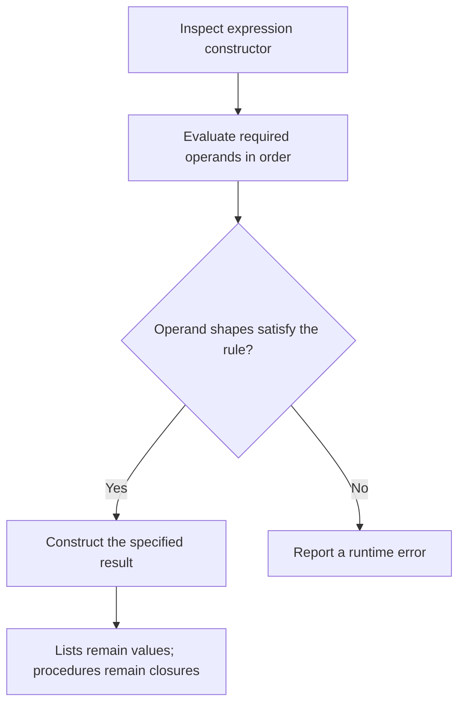
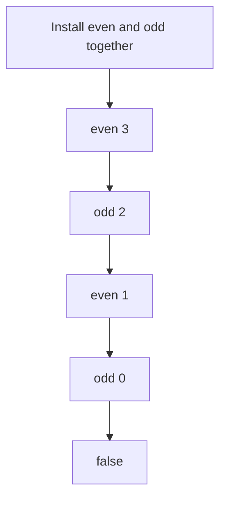

## Before you begin

**Read in the PDF:** [Chapter 5, pp. 147–160](https://prl.korea.ac.kr/courses/cose212/2026/pl-book-eng.pdf#page=147). **Goal:** combine familiar rules into a larger functional interpreter. **Definitions:** [closure](glossary.html#closure), [environment](glossary.html#environment), [call by value](glossary.html#call-by-value).

## 5.1 Syntactic Structure

[Read in the PDF: p. 147](https://prl.korea.ac.kr/courses/cose212/2026/pl-book-eng.pdf#page=147).

Fun adds unit, boolean constants, lists, multiplication and division, comparison, boolean negation, mutually recursive definitions, output, and sequencing. The useful way to read this larger grammar is in families: **data**, **operations on data**, **binding and calls**, and **effects that impose an order**.

Unit is the single value used when a computation has no informative result. An empty list is a different value. The syntax constructor `NIL` creates a list; `ISNIL` tests one; `HEAD` and `TAIL` require a nonempty list. Each operation has its own contract.

## 5.2 Semantic Structure

[Read in the PDF: p. 148](https://prl.korea.ac.kr/courses/cose212/2026/pl-book-eng.pdf#page=148).

Extend the value domain to `Unit`, integers, booleans, lists of values, ordinary closures, recursive closures, and mutually recursive closures. An untyped evaluator's list can contain different value shapes; the homogeneous-list type discipline arrives later, in Chapter 8.

For `CONS(a,b)`, evaluate a to a value and b to a list, then prepend. For append, both values must be lists. Arithmetic requires integers. The book's equality cases compare two integers or two booleans; using OCaml's generic structural equality on all values would silently add other cases, including inappropriate procedure comparisons.



### Mutual recursion

Both definitions must be available in either function body. Keep the pair's definitions and their shared outer environment together. Calling even reinstalls even and odd, then its parameter; calling odd performs the corresponding operation with odd as the selected body. Installing only the called function makes the first cross-call fail.



`PRINT e` first evaluates e, emits its representation, and returns Unit. `SEQ(a,b)` evaluates a for its effect, then b for the final result. Explicit `let` bindings in the interpreter enforce the intended left-to-right operand order; relying on the host language's argument evaluation order is unsafe.

## 5.3 Implementation

[Read in the PDF: pp. 156–160](https://prl.korea.ac.kr/courses/cose212/2026/pl-book-eng.pdf#page=156). **Task:** implement `run : program -> value` for all listed constructors.

[Download the complete Fun solution](examples/textbook_functional.ml). It covers the entire listed syntax and has an injectable output function, making print order testable without reading console output by eye. It reports invalid shapes, empty-list operations, division by zero, and unbound names with `Runtime_error`.

### Worked solution: reverse

The recursive reverse program in the PDF checks for an empty list. Otherwise it reverses the tail and appends a singleton containing the head. On `[1;2;3]`:

```text
reverse [1;2;3]
= reverse [2;3] @ [1]
= (reverse [3] @ [2]) @ [1]
= (([] @ [3]) @ [2]) @ [1]
= [3;2;1]
```

At each step, `HEAD` and `TAIL` occur only in the nonempty branch. Evaluating both IF branches would wrongly apply them to NIL at the base case.

### Worked solution: output loop

The factorial example defines a recursive numeric function and a second recursive procedure that prints successive results while decreasing its counter. `PRINT`'s result is discarded by `SEQ`; the terminal branch returns Unit. The list-producing example on p. 160 returns descending integers because it **conses n before** the result for n−1. Follow the constructor order rather than assuming a function named range must ascend.

**Check before continuing:** even(8) is true, odd(8) is false, reversing three elements preserves all three, an invalid equality is rejected, and a print sequence preserves output order.

**Homework connection:** [HW2](hw2.html) uses a closely related language with its own supplied names and specification. The textbook solution does not replace that handout's contract. Next: [Chapter 6](textbook-06.html).
