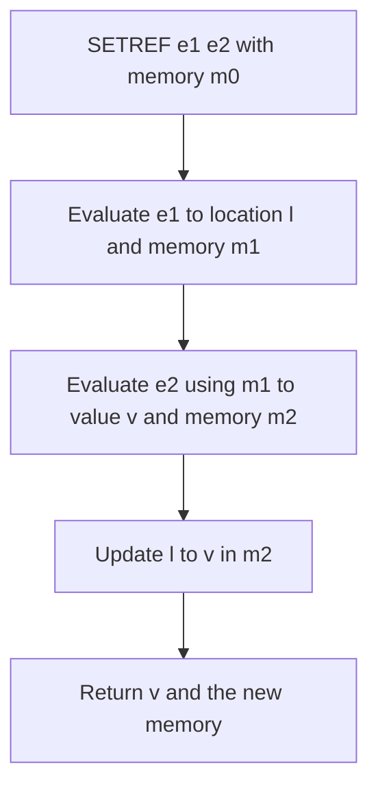
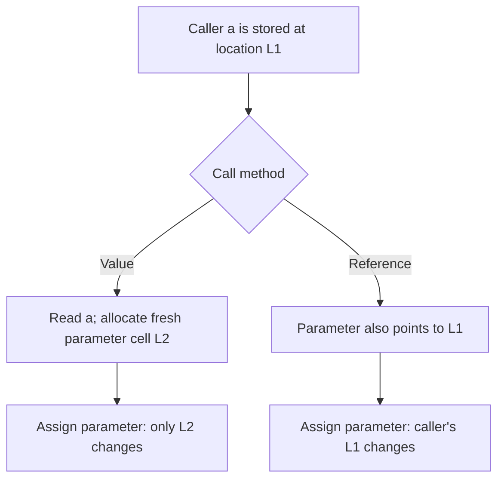

## Before you begin

**Read in the PDF:** [Chapter 6, pp. 161–192](https://prl.korea.ac.kr/courses/cose212/2026/pl-book-eng.pdf#page=161). **Goal:** explain a changing value without confusing a variable name with a memory cell. **Definitions:** [store](glossary.html#store), [call by value](glossary.html#call-by-value), [call by reference](glossary.html#call-by-reference).

## 6.1 First Approach

[Read in the PDF: p. 162](https://prl.korea.ac.kr/courses/cose212/2026/pl-book-eng.pdf#page=162).

The first model makes references explicit. Environments still map names to values, but a value may now be a location. The store maps locations to current values. Creating a reference allocates a cell; reading it follows the location; assigning it changes the store.

**Think in two arrows:** `name → value` in the environment; if that value is a location, `location → current contents` in memory. A reference is a value that identifies a cell, not the contents of that cell.

## 6.1.1 Syntactic Structure

[Read in the PDF: p. 163](https://prl.korea.ac.kr/courses/cose212/2026/pl-book-eng.pdf#page=163).

Add explicit allocation, dereference, reference assignment, and sequencing. The implementation constructors are `NEWREF`, `DEREF`, `SETREF`, and `SEQ`. A variable lookup does not automatically dereference a location value in this model.

## 6.1.2 Semantic Structure

[Read in the PDF: p. 165](https://prl.korea.ac.kr/courses/cose212/2026/pl-book-eng.pdf#page=165).

Evaluation now has the contract `eval : exp -> env -> mem -> value * mem`. Every premise receives the store produced by the preceding premise. Even an arithmetic expression can change memory when its operands call stateful procedures.

**Worked trace:** a counter starts at 0; f increments it and returns its new contents. In `f 0 + f 0`, the first call returns 1 and passes the changed store to the second call, which returns 2. The sum is **3**. Reusing the original store for both operands would produce the wrong result.

## 6.2 Second Approach

[Read in the PDF: p. 174](https://prl.korea.ac.kr/courses/cose212/2026/pl-book-eng.pdf#page=174).

The second model makes variable storage implicit. The environment maps each variable to a location, and lookup reads that location's value from memory. A let binding allocates a fresh variable cell. Assignment changes that cell without changing the environment mapping.

**Compare the two models before continuing:**

| Question | Explicit references | Implicit references |
|---|---|---|
| What does an ordinary variable denote? | A value, which may be a location | A location whose contents are read automatically |
| What does ordinary let do? | Bind the evaluated value | Allocate a variable cell and bind its location |
| How is a cell read? | An explicit dereference operation | Ordinary variable access follows both maps |
| What changes during assignment? | Contents at the target reference | Contents at the variable’s location |

In both models, the store records mutation. Neither model permits discarding an operand’s updated memory.

## 6.2.1 Syntactic Structure

[Read in the PDF: p. 174](https://prl.korea.ac.kr/courses/cose212/2026/pl-book-eng.pdf#page=174).

The important change is variable assignment, represented by `SET(x,e)`, plus a call-by-reference form. Explicit dereferencing is no longer required for ordinary variable access. Chapter 7 later adds first-class pointers to this model.

## 6.2.2 Semantic Structure

[Read in the PDF: p. 175](https://prl.korea.ac.kr/courses/cose212/2026/pl-book-eng.pdf#page=175).

Keep the two maps separate: `ρ(x) = l` and `σ(l) = v`. Evaluating `VAR x` follows both. For `LET(x,a,b)`, evaluate a, allocate a fresh location for its value, extend the environment with that location, then evaluate b using the updated memory. A closure saves an environment of locations, while each call uses the current store, so changes to captured cells remain visible.

## 6.2.3 Function Call Method

[Read in the PDF: p. 183](https://prl.korea.ac.kr/courses/cose212/2026/pl-book-eng.pdf#page=183).

Call by value allocates a fresh parameter cell initialized with the argument's value. Call by reference binds the parameter directly to the caller variable's existing location. Both evaluate the body using the closure's definition environment extended appropriately.

**Worked result:** start with a = 1 and let f set its parameter to 9. After a value call, a remains **1**. After a reference call, a becomes **9**. Copying a record value can still share its field locations; “call by value” does not imply recursively copying every reachable cell.

## 6.3 Implementation

[Read in the PDF: pp. 188–192](https://prl.korea.ac.kr/courses/cose212/2026/pl-book-eng.pdf#page=188). **Tasks:** implement both explicit-reference and implicit-reference interpreters.

[Download the complete state solutions](examples/textbook_state.ml). Run `ocaml textbook_state.ml`. The engine makes the two modes explicit: `run Explicit expression` and `run Implicit expression`. Environment bindings are tagged as values or addresses, and memory is an immutable finite map with a fresh-location counter. Chapter 7 reuses this engine.

### Solution A — Explicit references

Ordinary let and argument binding install values. `NEWREF` evaluates its initializer and allocates; `DEREF` checks for a location and reads it; `SETREF` evaluates the target before the right-hand side and updates the returned store. Assignment returns the assigned value, following the book's rules.

### Solution B — Implicit references

Let and value calls allocate cells. `VAR` reads through the binding's address. `SET` changes the existing address. `CALLREF` resolves its variable argument in the caller, then aliases that location in the callee. Recursive procedure binding first reserves a cell and then stores a closure whose captured environment includes that cell; this supports self-reference without rebuilding the whole environment.

**Checks included:** counter ordering, both parameter modes, recursion, pointers and record sharing for the next chapter. The counter is part of each store, so separate runs begin independently and collection does not reuse an old address accidentally.

**Homework connection:** [HW3](hw3.html) depends on these distinctions, while using its own AST. Next: [Chapter 7](textbook-07.html).
