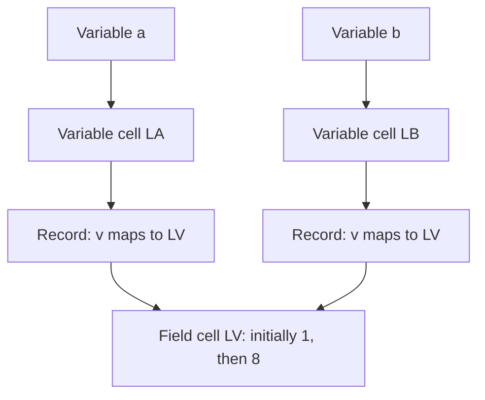
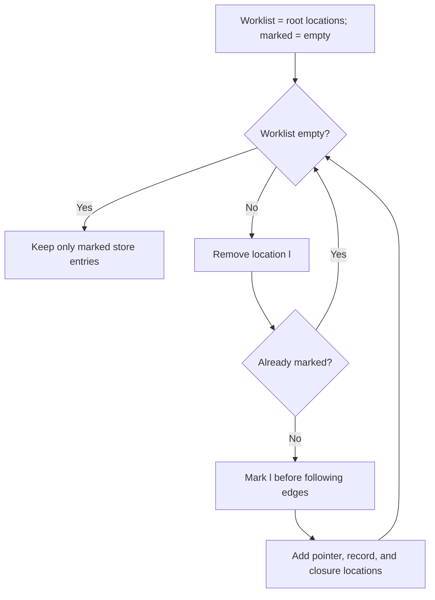
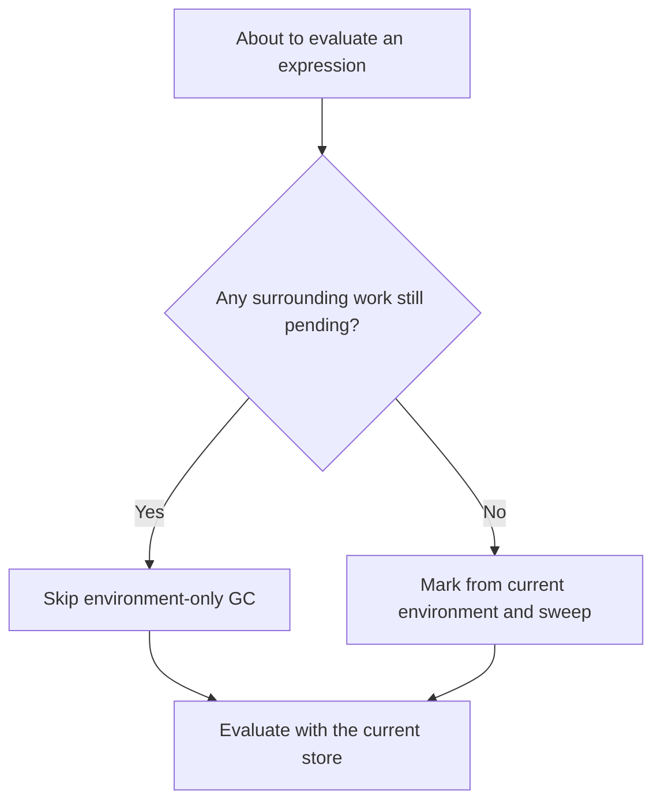

## Before you begin

**Read in the PDF:** [Chapter 7, pp. 193–221](https://prl.korea.ac.kr/courses/cose212/2026/pl-book-eng.pdf#page=193). **Goal:** follow the heap graph and conservatively retain reachable cells; reachability does not predict exactly which cells will be used again. **Definitions:** [record](glossary.html#record), [store](glossary.html#store), [garbage collection](glossary.html#garbage-collection).

## 7.1 Records

[Read in the PDF: p. 194](https://prl.korea.ac.kr/courses/cose212/2026/pl-book-eng.pdf#page=194).

A record value maps field names to locations. Each field therefore has its own mutable cell. Selecting a field first evaluates the record, finds the field location, and reads the current store. Updating a field changes that cell. Copying the record value preserves its field locations, so copies can share mutable fields.

**Trace:** create a record a, bind b to a's value, then set `b.v` to 8. Reading `a.v` gives 8. Reassigning the whole variable b would change b's variable cell; it would not automatically change a's variable cell. Field assignment and variable assignment follow different arrows.

## 7.2 Pointers

[Read in the PDF: p. 201](https://prl.korea.ac.kr/courses/cose212/2026/pl-book-eng.pdf#page=201).

A pointer is a first-class location value. `&x` returns the location already associated with x. `new e` allocates a new cell initialized by e. Dereferencing reads the pointed-to cell; pointer assignment updates it. A pointer variable itself has a cell that contains the pointer, so distinguish the variable's location from the location stored inside it.

For `let x = 1 in let p = &x in *p := 7; x`, p's contents point to x's cell. The assignment updates that cell, and the final result is 7. Returning the address of a parameter is valid under this chapter's heap model while that cell remains reachable; automatically freeing every parameter cell on return would be incorrect.

The prose includes taking a field's address, but the §7.4 supplied AST has only `ADDROF of var`. The solution follows the listed AST. Adding field-address syntax would reuse the field-location lookup already used by `FIELDASSIGN`.

## 7.3 Memory Management

[Read in the PDF: p. 208](https://prl.korea.ac.kr/courses/cose212/2026/pl-book-eng.pdf#page=208).

Allocation grows the store. The question is which cells can be reclaimed without changing program behavior. Scope alone is insufficient: a pointer or closure can keep a cell accessible after the binding that created it has gone out of scope.

## 7.3.1 Manual Memory Reclamation

[Read in the PDF: p. 210](https://prl.korea.ac.kr/courses/cose212/2026/pl-book-eng.pdf#page=210).

Manual deallocation makes the program responsible for deciding when a cell is no longer needed. Reclaiming too soon creates a dangling reference; reclaiming the same cell twice is another error; never reclaiming inaccessible cells wastes memory. Aliasing makes the decision harder because one name disappearing does not establish that no other reference remains.

## 7.3.2 Automatic Memory Recycling

[Read in the PDF: p. 212](https://prl.korea.ac.kr/courses/cose212/2026/pl-book-eng.pdf#page=212).

Garbage collection uses a conservative, computable approximation to “will be used again”: retain all cells reachable from the roots. Start from environment locations. Follow location values, record-field locations, and environments captured by closures. Continue until no new locations are found. Sweep cells outside the resulting set.

**Worked heap:** roots contain location 0; cell 0 points to 1; cell 1 points to 0; cell 2 contains an unrelated integer. The reachable set is `{0,1}`. Marking before traversing prevents the cycle from looping forever. Cell 2 is removed. Reference counting alone would have difficulty reclaiming an unreachable cycle; tracing collection can reclaim it when it has no path from a root.

Reachability includes pending computation, not just the environment of the expression currently executing. The book limits collection to points with **no remaining continuation** when it roots only in the current environment. Collecting during an arbitrary nested call could delete a value the caller still needs.

## 7.4 Implementation

[Read in the PDF: pp. 219–221](https://prl.korea.ac.kr/courses/cose212/2026/pl-book-eng.pdf#page=219). [Download all four worked tasks](examples/textbook_state.ml).

### Task 1 — Define values, environment, and memory

Use integers, booleans, pointers, records, and closures as values. In implicit mode, an environment maps names to locations. Represent the store as a finite association list plus a monotonically increasing fresh-location counter. Unlike a plain function `loc -> value`, this representation lets the collector enumerate allocated cells for sweeping. Updating removes the previous mapping for the same location.

### Task 2 — Implement the evaluator

Use the Chapter 6 state-threading pattern for every constructor. Record construction evaluates both initializers in order, allocates their cells, and returns a field map. `FIELD` and `DEREF` read cells. `FIELDASSIGN` and `STORE` update them. Procedure calls retain lexical scope and the current store.

**Source discrepancy:** p. 220 prints `eval : program -> env -> mem -> mem`. The language's expression rules need both the value and updated memory internally. The solution therefore uses `eval ... -> value * mem` and provides `eval_memory` as an adapter with the printed memory-only result. Throwing away intermediate values inside the recursive evaluator would make arithmetic and field access impossible.

### Task 3 — Implement gc

Compute the transitive closure of all root locations, then filter the store. The solution follows pointers, record fields, ordinary closures, and recursive closures. An already-marked set terminates cycles. Its list-based implementation favors readability; hash sets or balanced trees improve large-heap performance. It conservatively includes shadowed environment entries, which can retain extra cells but cannot free a live one.

### Task 4 — Integrate gc safely

The executable solution threads a flag meaning **no outer computation remains**. It begins true for the whole run. Conditions, operands, initializers, and call arguments run with it false. A final branch, let body, sequence's second expression, or call body inherits the outer flag. Collection happens only on entry when that flag is true. With `run ~collect:true Implicit e`, this implements the textbook's restricted safe-point policy.

**Why the restriction matters:** in `f 0 + !p`, the caller still needs p after f returns. Inside f, p may be absent from the callee environment. The implementation must not collect p there. Its regression test checks this exact kind of pending-work case, and compares collection-enabled results with ordinary evaluation.

For more frequent collection, explicitly represent all continuation frames and root their environments and temporary values too. That is a larger machine than the textbook task asks for.

**Homework connection:** [HW3 record and memory reasoning](hw3.html). Next: [Chapter 8](textbook-08.html).
