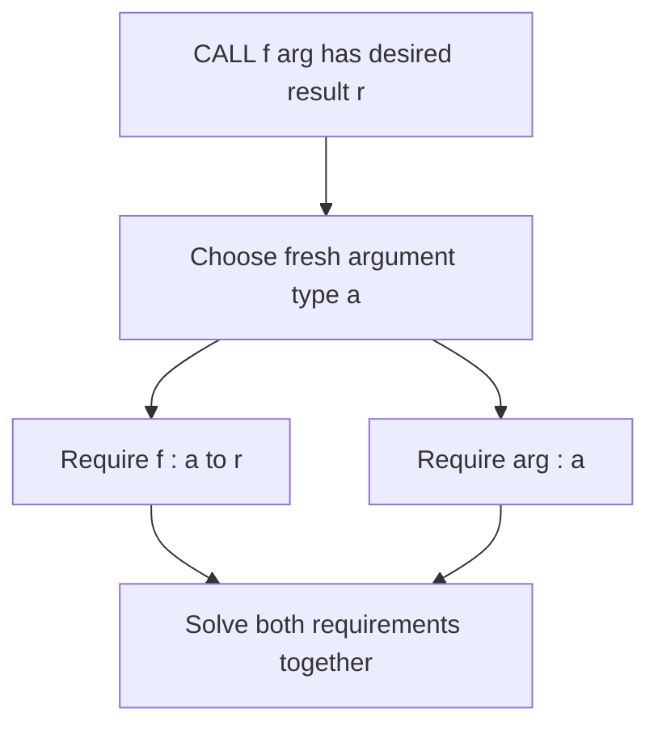
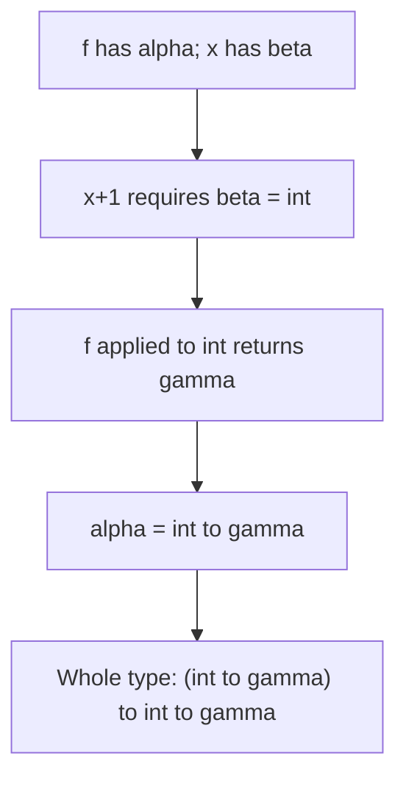
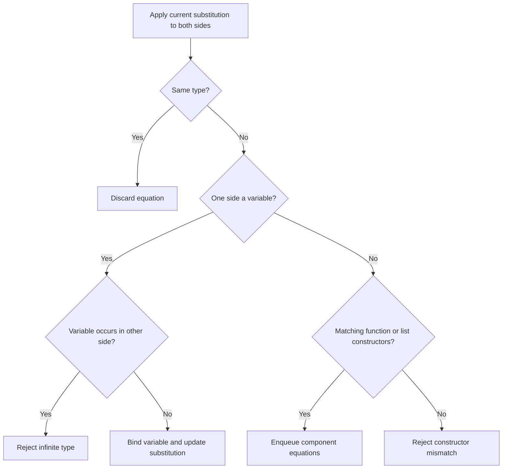
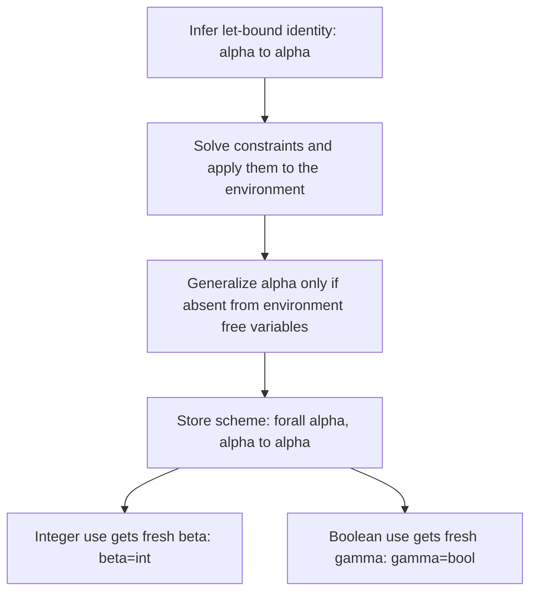

## Before you begin

**Read in the PDF:** [Chapter 8, pp. 223–276](https://prl.korea.ac.kr/courses/cose212/2026/pl-book-eng.pdf#page=223). **Goal:** derive and solve the conditions under which a program has a type. **Definitions:** [type environment](glossary.html#type-environment), [unification](glossary.html#unification), [occurs check](glossary.html#occurs-check), [type scheme](glossary.html#type-scheme).

## 8.1 Target Language

[Read in the PDF: p. 225](https://prl.korea.ac.kr/courses/cose212/2026/pl-book-eng.pdf#page=225).

The initial language returns to a small pure core: numbers, variables, arithmetic, a zero test, conditionals, let, procedures, and calls. Reducing the language lets you focus on typing rules before extending them to Fun. A type checker analyzes the syntax tree; it does not run the program to discover what a variable happens to contain.

## 8.2 Type

[Read in the PDF: p. 226](https://prl.korea.ac.kr/courses/cose212/2026/pl-book-eng.pdf#page=226).

Types include `int`, `bool`, and function types `a -> b`. An unknown type variable α represents a type to be determined, not an arbitrary runtime value. The type of a function records the relation between acceptable argument types and returned result types.

For `fun x -> x+1`, addition constrains x to int and the result is int; hence `int -> int`. For `fun x -> x`, input and result must be the same unknown type, producing `α -> α`.

## 8.3 Type Environment

[Read in the PDF: p. 230](https://prl.korea.ac.kr/courses/cose212/2026/pl-book-eng.pdf#page=230).

A type environment Γ maps names to types. This is distinct from the runtime environment ρ, which maps names to values or locations. Typing `VAR x` consults Γ. Typing a procedure extends Γ with its parameter's type before analyzing the body.

## 8.4 Type Inference Rules

[Read in the PDF: p. 232](https://prl.korea.ac.kr/courses/cose212/2026/pl-book-eng.pdf#page=232).

The judgment `Γ ⊢ e : t` means e has type t under Γ. Addition requires two integer operands and returns int. A conditional requires a boolean condition and equal branch types. A call requires a function whose parameter type matches the argument type.

Both branches of IF are checked even though evaluation runs only one. Typing is a static structural analysis; it normally does not use a concrete condition value to excuse a mistyped branch.

## 8.5 Type Checker Implementation Approach

[Read in the PDF: p. 243](https://prl.korea.ac.kr/courses/cose212/2026/pl-book-eng.pdf#page=243).

An evaluator often computes children and combines concrete values immediately. A checker cannot always know a procedure parameter's type before it examines the body and its uses. One approach asks the programmer for annotations. Automatic inference instead introduces unknowns and records equations to solve later.

This separation avoids guessing types or trying every possible function type. The syntax determines constraints; the solver propagates consequences across distant uses of the same unknown.

## 8.6 Automatic Type Inference Algorithm

[Read in the PDF: p. 248](https://prl.korea.ac.kr/courses/cose212/2026/pl-book-eng.pdf#page=248).

The pipeline is: allocate a fresh type for the whole expression, generate equations, solve them, then apply the resulting substitution to the requested type. A substitution maps type variables to types and must act recursively inside function and list types.

## 8.6.1 Generating Type Equations

[Read in the PDF: p. 248](https://prl.korea.ac.kr/courses/cose212/2026/pl-book-eng.pdf#page=248).

Let `G(Γ,e,t)` produce the conditions for e to have expected type t. A constant adds `t = int`. A variable adds `t = Γ(x)`. A procedure introduces fresh a and b, adds `t = a -> b`, and generates the body at b under `Γ[x ↦ a]`. A monomorphic let introduces one fresh type shared by the definition and all uses in its body.

**Worked example:** infer `fun f -> fun x -> f (x+1)`.

1. Give f type α and x type β.
2. Addition requires β = int and returns int.
3. Give the call result type γ; application requires α = int → γ.
4. The outer result is `(int → γ) → int → γ`.

## 8.6.2 Solving Type Equations

[Read in the PDF: p. 259](https://prl.korea.ac.kr/courses/cose212/2026/pl-book-eng.pdf#page=259).

Unification repeatedly normalizes both sides under the current substitution. Equal types need no work. Function types decompose into parameter and result equations. A variable can be bound to a type if it does not occur inside that type. Different concrete constructors, such as int and bool, fail.

The occurs check rejects `α = α -> β`, which would require an infinite type in this finite simple-type system. Self-application `fun x -> x x` produces precisely this kind of equation.

**Worked substitution:** from `α = β` and `β = int`, the final answer must make α int too. Keeping the first association without recursively applying or composing later substitutions would leave a stale variable. The solution file both normalizes existing entries and recursively applies substitutions.

## 8.7 Polymorphic Type Systems

[Read in the PDF: p. 271](https://prl.korea.ac.kr/courses/cose212/2026/pl-book-eng.pdf#page=271).

A single monomorphic unknown is shared by all uses of a binding. Thus using the same identity function on both an integer and a boolean can force an inconsistent equation. Let-polymorphism instead stores a type scheme and creates fresh instances at each use.

The key rule is `generalize(Γ,t) = ∀(FTV(t) − FTV(Γ)).t`. Only variables independent of the surrounding type environment may be generalized. Ordinary procedure parameters remain monomorphic. At lookup, instantiate the quantified variables with fresh unknowns; do not freshen the unquantified environment-dependent variables.

The downloadable §8.8 checker deliberately implements the initial **monomorphic** equation system and a monomorphic Fun extension. This section explains the separate let-polymorphic extension; the file is not presented as an OCaml-equivalent polymorphic type checker. See [the detailed polymorphism chapter](13-polymorphism.html) for further worked cases.

## 8.8 Implementation

[Read in the PDF: pp. 274–276](https://prl.korea.ac.kr/courses/cose212/2026/pl-book-eng.pdf#page=274). [Download the complete generator, solver, and Fun extension](examples/textbook_types.ml). Run `ocaml textbook_types.ml`.

### Task 1 — gen_equations

Generate one group of constraints for each constructor using the rules above. Pass the expected type down the tree. Procedure definitions introduce fresh input and output types; calls introduce a fresh argument type; conditionals check the guard at bool and both branches at the same expected type. An unknown variable name is a typing error, not a fresh free identifier.

### Task 2 — solve and typecheck

Maintain a worklist and a substitution. Normalize before each comparison, decompose compound types, perform the occurs check before extending, and reject incompatible constructors. Finally apply the solved substitution to the root's fresh type. Tests cover chained substitutions, function decomposition, unbound names, incompatible branches, and self-application.

### Task 3 — Extend to Fun

Add Unit and list types. NIL has `list α` for a fresh α; CONS requires a head of type α and tail of type `list α`; APPEND requires matching list types; HEAD returns α; TAIL returns `list α`; ISNIL returns bool. PRINT checks its operand and returns Unit; SEQ checks both operands and returns the second type.

Recursive definitions prebind their function types before checking bodies. Mutual recursion prebinds both function types before either body. All recursive calls within this extension are monomorphic.

**Equality needs more than an ordinary equation.** The evaluator permits int/int and bool/bool equality, not arbitrary list or function equality. The solution records a scalar restriction and tries these two alternatives with unification. `infer_fun` returns all consistent resulting types. Consequently `fun x -> x=x` has two alternatives, `int -> bool` and `bool -> bool`, rather than an unrestricted `α -> bool`. This straightforward solver can be exponential in unresolved equality constraints; it is intended for small teaching examples.

**What successful typing does not establish:** `HEAD NIL` can have a list-element type while failing dynamically, and integer division can still encounter zero. These shape types do not prove nonemptiness, nonzero divisors, termination, or freedom from integer overflow. Stronger refinements would be a separate analysis.

**Homework connection:** [HW4](hw4.html) asks for a related checker but has its own interface and policy questions. Next: [Chapter 9](textbook-09.html).
