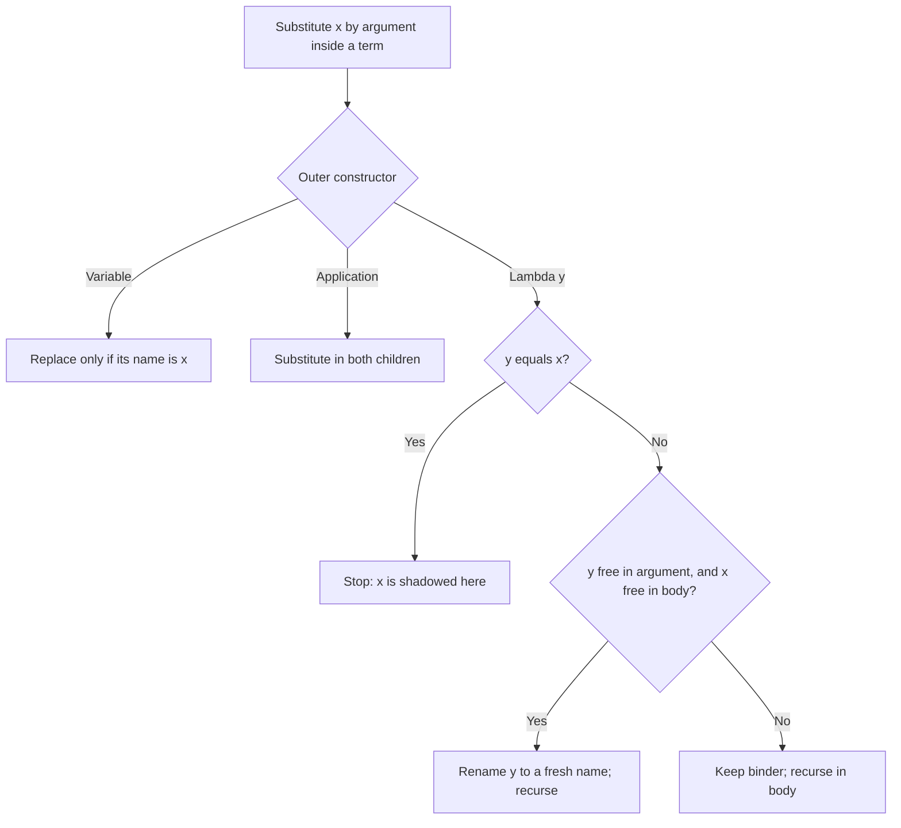
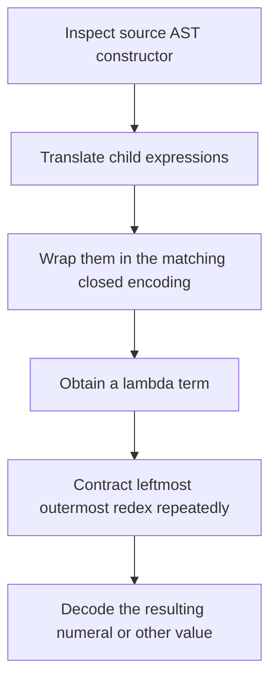
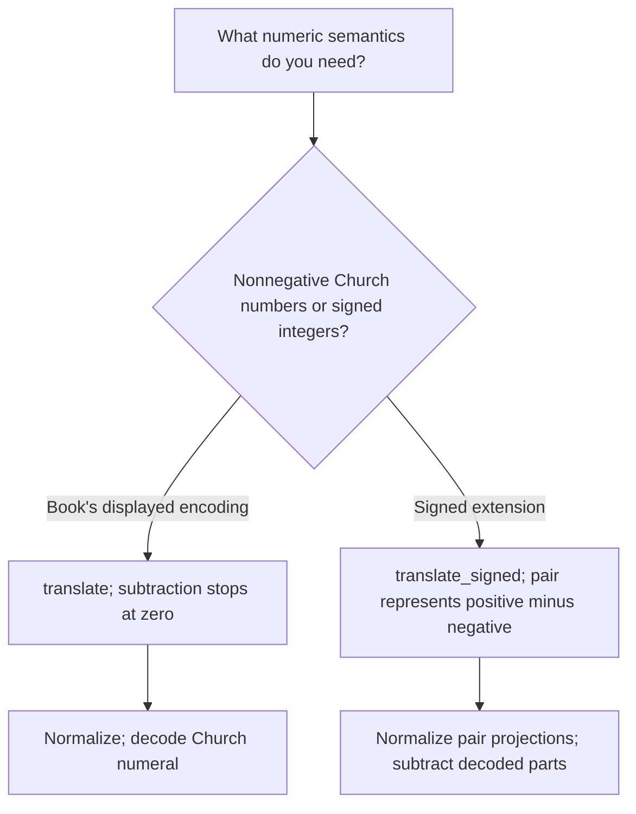

## Before you begin

**Read in the PDF:** [Chapter 9, pp. 277–292](https://prl.korea.ac.kr/courses/cose212/2026/pl-book-eng.pdf#page=277). **Goal:** represent computation using only names, functions, and application. **Definitions:** [lambda calculus](glossary.html#lambda-calculus), [beta reduction](glossary.html#beta-reduction), [capture-avoiding substitution](glossary.html#capture-avoiding-substitution).

## 9.1 Lambda Calculus

[Read in the PDF: p. 277](https://prl.korea.ac.kr/courses/cose212/2026/pl-book-eng.pdf#page=277).

A lambda term is a variable, an abstraction `λx.body`, or an application `f arg`. Application associates to the left: `a b c` means `(a b) c`. An abstraction's body extends rightward as far as its enclosing parentheses allow. Establish the tree before attempting reduction.

Beta reduction replaces `(λx.body) arg` by the body with free occurrences of x replaced by arg. The key word is **free**. A nested abstraction binding x shields its own occurrences. A nested binder sharing a name with a free variable of arg must be renamed before substitution to avoid capture.



**Worked substitution:** `(λx. λy. x y) y` cannot become `λy. y y`, because that would bind the argument's formerly free y. Rename the inner y to z first. The result is `λz. y z`. In contrast, `(λx. λx. x) y` reduces to `λx. x`; the inner binder prevents replacement.

### Normal order and normal form

Normal order repeatedly contracts the leftmost outermost redex, including redexes inside abstractions when seeking a full normal form. A weak evaluator that stops as soon as it sees a lambda is not the requested normalizer.

Let Ω be `(λx. x x) (λx. x x)`. In `(λunused. answer) Ω`, normal order contracts the outer call and returns `answer` without reducing Ω. Eager evaluation would try Ω first and diverge. Normal order reaches a normal form when one exists, but some terms have none; no reducer can promise termination for every input.

## 9.2 Converting to a Lambda Expression

[Read in the PDF: p. 285](https://prl.korea.ac.kr/courses/cose212/2026/pl-book-eng.pdf#page=285).

Church booleans choose between two arguments: true selects the first and false selects the second. A Church numeral n applies its first argument n times to its second. Thus three is `λs. λz. s (s (s z))`. The data's meaning is its behavior when supplied suitable arguments.

| Source form | Translation idea |
|---|---|
| Nonnegative n | Apply s n times to z, inside two lambdas |
| Variable or procedure | Preserve the name or introduce the corresponding lambda |
| Call | Translate both children and apply |
| Addition | Compose the two numerals' iterations |
| Multiplication | Iterate one numeral's repeated application using the other |
| Zero test | Iterate a constant-false function starting at true |
| Conditional | Apply the translated boolean to the two translated branches |
| Let | Apply a lambda for the body to the translated definition |
| Letrec | Use Y on a functional that receives its recursive self |



For `1 + 2`, the normalized term applies s three times to z. For recursion, write a functional F that accepts the would-be recursive function. The Y combinator yields a term behaving as F applied to its own fixed point. Under normal order, a conditional can reach the recursion's base case without first expanding every recursive branch.

**Two boundaries in the source:** p. 287 explicitly restricts the displayed number encoding to naturals and omits signed integers. Also, translating by these equations and using normal order does not preserve the termination behavior of a call-by-value source program in every case. The unused-Ω example shows why. Treat this as the book's normal-order encoding exercise, not a proof of full call-by-value compiler correctness.

## 9.3 Implementation

[Read in the PDF: pp. 291–292](https://prl.korea.ac.kr/courses/cose212/2026/pl-book-eng.pdf#page=291). [Download the complete reducer and translators](examples/textbook_lambda.ml). Run `ocaml textbook_lambda.ml`.

### Task 1 — reduce

Implement free-variable collection and capture-avoiding substitution first. Then implement `step`, which returns one reduced term or reports that no redex exists:

1. An application whose function is already a lambda contracts immediately; do not reduce its argument first.
2. Otherwise search the function child, then the argument child.
3. Inside a lambda, search its body.
4. A variable has no reduction step.

Repeat `step` until it reports none. The file provides the exact `reduce : lambda -> lambda` interface and a separate `reduce_bounded` utility for demonstrations that might diverge. A step-limit result means “not finished within this budget,” not “proved divergent.”

### Task 2 — translate

The `translate` function handles every source constructor using the natural-number convention, including predecessor-based subtraction and multiplication. Natural subtraction is truncated at zero, so `1 − 3` becomes 0 in this convention; negative constants are rejected. Addition, variables, procedures, calls, zero tests, conditionals, let, and recursive let follow the book's encodings. Built-in encodings are closed terms, preventing accidental capture of source variables when they are inserted.

The optional **`translate_signed`** extension handles negative integers and ordinary subtraction by encoding an integer as a pair `(positivePart, negativePart)` representing their difference. For pairs `(a,b)` and `(c,d)`:

```text
addition       = (a+c, b+d)
subtraction    = (a+d, b+c)
multiplication = (ac+bd, ad+bc)
zero test      = a and b represent the same natural number
```

This extension changes the number representation, so use `decode_signed`, not the ordinary Church-numeral decoder. It intentionally rejects OCaml's `min_int` constant because its positive magnitude cannot be represented by the host integer used to build numerals. Large encodings can consume substantial time and memory.



**Checks included:** capture avoidance, shadowing, normalization under a lambda, ignoring an unused divergent argument, the book's `1+2` example, arithmetic, conditionals, procedure calls, factorial via Y, signed subtraction, signed multiplication, and cancellation to zero.

**Final connection:** Chapters 3–7 implement meaning by traversing syntax with environments and stores. Chapter 8 traverses syntax to generate logical constraints. This chapter traverses syntax to produce another language. The recurring skill is to identify the constructor, preserve its binding structure, and explain how its children determine its meaning.

[Return to the textbook contents](textbook.html) · [Open the course homework map](homework-map.html).
