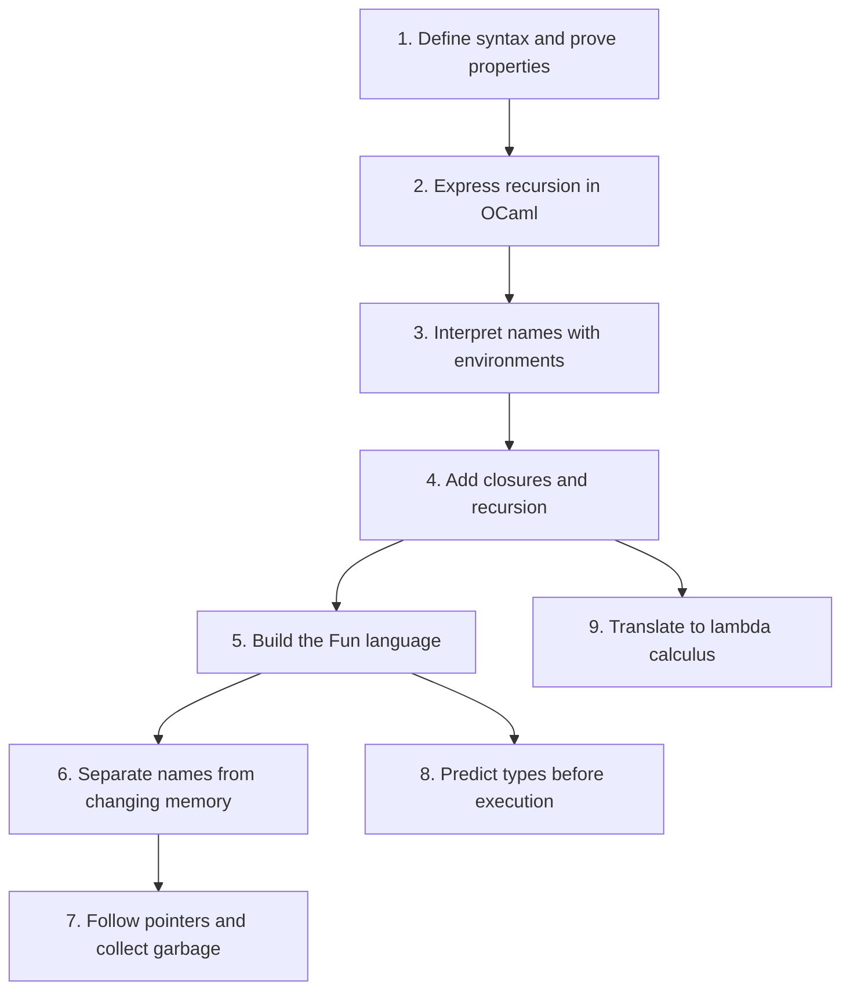

## New reading tools

[Chapter cheat sheets 1–9](#chapter-cheat-sheets) · [Step-by-step reading guide](#chapter-by-chapter-reading-guide) · [Lectures integrated into the textbook](textbook.html#lecture-to-chapter-map) · [Syntax and notation reference](syntax.html). Read definitions, lecture examples, Mermaid thinking flows, and chapter code walkthroughs along one textbook path.

## Read the textbook with a guide beside you

This reader follows **Hakjoo Oh’s _Principles of Programming Languages_ (English draft, 31 August 2026)** in its own nine-chapter order. Section numbers and PDF page links match the downloaded book. Explanations, Mermaid diagrams, and worked solutions here are original companion material; use the linked PDF whenever you want the author's exact wording, figures, or notation.

**How to read:** skim the chapter cheat sheet, then read its numbered sections. Lecture highlights appear beside the matching idea; expand **Practice with Lecture…** for a worked example, numbered Mermaid flow, homework connection, and self-check. The chapter’s reading-route links let you jump directly to sections or code. Answer the **Predict** checkpoint before revealing the reasoning and common trap. These checks are original practice prompts, separate from numbered textbook exercises. Use **Syntax beside you** for an unfamiliar symbol without leaving the section, then attempt the chapter’s problems before opening solutions. Highlighted terms link to precise definitions. A section's **Read in the PDF** link takes you to its source page. Textbook problem numbers are separate from the course homework numbers.

**For a first reading:** open **Step by step** when a summary moves too quickly. These 25 expandable explanations restore intermediate steps from the PDF's progression, using original examples, numbered reasoning, tables, and Mermaid diagrams. For revision, leave them closed and use the cheat sheet and checkpoints. The reader follows all 48 numbered source sections; it is a companion to the PDF, not a reproduction of every paragraph and figure.

## Chapter-by-chapter reading guide

The PDF comparison found that the earlier website was easier to scan but often too compressed for a first encounter. Start with the added explanation matching your difficulty:

| Chapter | Main gap addressed | Open the worked explanation |
|---|---|---|
| 1 · Induction | Moving from constructors to rules and proofs | [Membership tree](textbook-01.html#depth-1-1) · [Evaluation rules](textbook-01.html#depth-1-2) · [Induction hypotheses](textbook-01.html#depth-1-3) |
| 2 · OCaml | Too little basic syntax before recursive exercises | [Types and patterns](textbook-02.html#depth-2-1) · [Recursive design](textbook-02.html#depth-2-2) · [Map, filter, fold](textbook-02.html#depth-2-3) |
| 3 · Environments | Map notation and missing derivation steps | [Read the notation](textbook-03.html#depth-3-2-1) · [Full let derivation](textbook-03.html#depth-3-2-2) |
| 4 · Functions | What a returned function remembers | [Free-variable calculation](textbook-04.html#depth-4-2) · [Returned closure](textbook-04.html#depth-4-2-1) · [Recursive binding](textbook-04.html#depth-4-2-3) |
| 5 · Fun | AST/value distinction and source-accurate list equality | [Three language layers](textbook-05.html#depth-5-1) · [Operation contracts](textbook-05.html#depth-5-2) |
| 6 · State | Seeing the exact cell changed at each step | [Memory trace](textbook-06.html#depth-6-1-2) · [Copy versus alias](textbook-06.html#depth-6-2-2) · [Parameter passing](textbook-06.html#depth-6-2-3) |
| 7 · Heap | Following all kinds of reference edges | [Pointer locations](textbook-07.html#depth-7-2) · [Complete marking example](textbook-07.html#depth-7-3-2) |
| 8 · Types | Intermediate equations and fresh-instance boundaries | [Typing derivation](textbook-08.html#depth-8-4) · [Two uses of f](textbook-08.html#depth-8-6-1) · [Solver state](textbook-08.html#depth-8-6-2) · [Schemes](textbook-08.html#depth-8-7) |
| 9 · Lambda calculus | Turning encoding formulas into reductions | [Substitution](textbook-09.html#depth-9-1) · [Church data](textbook-09.html#depth-9-2) · [One recursive unfolding](textbook-09.html#depth-9-3) |

## Part I — The tools for thinking

### 1. Induction · PDF pp. 11–32

[Read Chapter 1](textbook-01.html) · [Open PDF](https://prl.korea.ac.kr/courses/cose212/2026/pl-book-eng.pdf#page=11)

- [1.1 Inductive Definition of Sets](textbook-01.html#1-1-inductive-definition-of-sets)
- [1.2 Inductive Definition of Programming Languages](textbook-01.html#1-2-inductive-definition-of-programming-languages)
- [1.3 Inductive Proof](textbook-01.html#1-3-inductive-proof)

**You will be able to:** read construction rules, build a derivation, and prove a property by following the same cases. Chapter 1 supplies worked examples, not a separate numbered exercise set.

### 2. Functional Programming · PDF pp. 33–96

[Read Chapter 2](textbook-02.html) · [Open PDF](https://prl.korea.ac.kr/courses/cose212/2026/pl-book-eng.pdf#page=33)

- [2.1 OCaml Basics](textbook-02.html#2-1-ocaml-basics)
- [2.2 Recursive Functions](textbook-02.html#2-2-recursive-functions)
- [2.3 Higher-Order Functions](textbook-02.html#2-3-higher-order-functions)
- [2.4 Exercises: all 12 problems and solutions](textbook-02-problems.html)

**You will be able to:** turn data constructors into matching branches, choose a decreasing recursive argument, and express list computations as folds. Problem 10 has five subparts; each has both fold directions in the solution file.

## Part II — Build a language, one feature at a time

### 3. Variables and the Environment · PDF pp. 97–117

[Read Chapter 3](textbook-03.html) · [Open PDF](https://prl.korea.ac.kr/courses/cose212/2026/pl-book-eng.pdf#page=97)

- [3.1 Syntactic Structure](textbook-03.html#3-1-syntactic-structure)
- [3.2 Semantic Structure](textbook-03.html#3-2-semantic-structure)
- [3.2.1 Environment](textbook-03.html#3-2-1-environment)
- [3.2.2 Inference Rules](textbook-03.html#3-2-2-inference-rules)
- [3.3 Implementation](textbook-03.html#3-3-implementation)

**You will be able to:** translate each rule into an evaluator case and explain shadowing. This chapter gives a worked implementation rather than an unanswered numbered problem.

### 4. Defining and Calling Functions · PDF pp. 119–145

[Read Chapter 4](textbook-04.html) · [Open PDF](https://prl.korea.ac.kr/courses/cose212/2026/pl-book-eng.pdf#page=119)

- [4.1 Syntactic Structure](textbook-04.html#4-1-syntactic-structure)
- [4.2 Semantic Structure](textbook-04.html#4-2-semantic-structure)
- [4.2.1 Static Scope](textbook-04.html#4-2-1-static-scope)
- [4.2.2 Dynamic Scope](textbook-04.html#4-2-2-dynamic-scope)
- [4.2.3 Recursive Functions](textbook-04.html#4-2-3-recursive-functions)
- [4.3 Implementation: static and dynamic evaluators](textbook-04.html#4-3-implementation)

### 5. Functional Language Fun · PDF pp. 147–160

[Read Chapter 5](textbook-05.html) · [Open PDF](https://prl.korea.ac.kr/courses/cose212/2026/pl-book-eng.pdf#page=147)

- [5.1 Syntactic Structure](textbook-05.html#5-1-syntactic-structure)
- [5.2 Semantic Structure](textbook-05.html#5-2-semantic-structure)
- [5.3 Implementation: the complete Fun evaluator](textbook-05.html#5-3-implementation)

### 6. State Changes · PDF pp. 161–192

[Read Chapter 6](textbook-06.html) · [Open PDF](https://prl.korea.ac.kr/courses/cose212/2026/pl-book-eng.pdf#page=161)

- [6.1 First Approach: explicit references](textbook-06.html#6-1-first-approach)
- [6.1.1 Syntax](textbook-06.html#6-1-1-syntactic-structure) · [6.1.2 Semantics](textbook-06.html#6-1-2-semantic-structure)
- [6.2 Second Approach: implicit references](textbook-06.html#6-2-second-approach)
- [6.2.1 Syntax](textbook-06.html#6-2-1-syntactic-structure) · [6.2.2 Semantics](textbook-06.html#6-2-2-semantic-structure)
- [6.2.3 Function Call Method](textbook-06.html#6-2-3-function-call-method)
- [6.3 Implementation: both interpreters](textbook-06.html#6-3-implementation)

### 7. Pointers and Memory Management · PDF pp. 193–221

[Read Chapter 7](textbook-07.html) · [Open PDF](https://prl.korea.ac.kr/courses/cose212/2026/pl-book-eng.pdf#page=193)

- [7.1 Records](textbook-07.html#7-1-records)
- [7.2 Pointers](textbook-07.html#7-2-pointers)
- [7.3 Memory Management](textbook-07.html#7-3-memory-management)
- [7.3.1 Manual Memory Reclamation](textbook-07.html#7-3-1-manual-memory-reclamation)
- [7.3.2 Automatic Memory Recycling](textbook-07.html#7-3-2-automatic-memory-recycling)
- [7.4 Implementation: all four tasks](textbook-07.html#7-4-implementation)

## Part III — Reason about programs and their foundations

### 8. Static Type Systems · PDF pp. 223–276

[Read Chapter 8](textbook-08.html) · [Open PDF](https://prl.korea.ac.kr/courses/cose212/2026/pl-book-eng.pdf#page=223)

- [8.1 Target Language](textbook-08.html#8-1-target-language)
- [8.2 Type](textbook-08.html#8-2-type) · [8.3 Type Environment](textbook-08.html#8-3-type-environment)
- [8.4 Type Inference Rules](textbook-08.html#8-4-type-inference-rules)
- [8.5 Type Checker Implementation Approach](textbook-08.html#8-5-type-checker-implementation-approach)
- [8.6 Automatic Type Inference Algorithm](textbook-08.html#8-6-automatic-type-inference-algorithm)
- [8.6.1 Generating Type Equations](textbook-08.html#8-6-1-generating-type-equations)
- [8.6.2 Solving Type Equations](textbook-08.html#8-6-2-solving-type-equations)
- [8.7 Polymorphic Type Systems](textbook-08.html#8-7-polymorphic-type-systems)
- [8.8 Implementation: generator, solver, and restricted Fun checker](textbook-08.html#8-8-implementation)

### 9. Lambda Calculus · PDF pp. 277–292

[Read Chapter 9](textbook-09.html) · [Open PDF](https://prl.korea.ac.kr/courses/cose212/2026/pl-book-eng.pdf#page=277)

- [9.1 Lambda Calculus](textbook-09.html#9-1-lambda-calculus)
- [9.2 Converting to a Lambda Expression](textbook-09.html#9-2-converting-to-a-lambda-expression)
- [9.3 Implementation: reducer and translator](textbook-09.html#9-3-implementation)

## Keep the three kinds of material distinct

| Material | Where to find it | What it is for |
|---|---|---|
| Textbook reader | The nine chapters above | Read in the PDF's section order, with definitions and reasoning diagrams |
| Textbook solutions | §2.4 and each chapter's Implementation section | Original worked solutions to the textbook's own tasks |
| Course homework | [Homework map](homework-map.html) | The separately numbered 2026 assignments and their precise specifications |

The [concept chapters](01-induction.html) remain available for shorter explanations and interactive traces. Exceptions and classes appear in course slides but are not separate chapters in this English PDF.

## Source and solution notes

The source is a draft. Where a problem is ambiguous, the guide states the interpretation before solving it. In particular: §5.2 includes list equality but leaves nested comparisons open; §7.4's printed evaluator result needs an internal value-and-memory pair; the §8.8 downloadable checker deliberately supports only monomorphic types and scalar equality, so it covers less than the Fun evaluator; §9.2 initially encodes natural numbers and uses normal order. These are explained in their chapters.

## Chapter cheat sheets

Review the main idea, definitions, formula, example, and solving checklist before or after reading a chapter.

- [Chapter 1 cheat sheet](textbook-01.html#chapter-cheat-sheet)
- [Chapter 2 cheat sheet](textbook-02.html#chapter-cheat-sheet)
- [Chapter 3 cheat sheet](textbook-03.html#chapter-cheat-sheet)
- [Chapter 4 cheat sheet](textbook-04.html#chapter-cheat-sheet)
- [Chapter 5 cheat sheet](textbook-05.html#chapter-cheat-sheet)
- [Chapter 6 cheat sheet](textbook-06.html#chapter-cheat-sheet)
- [Chapter 7 cheat sheet](textbook-07.html#chapter-cheat-sheet)
- [Chapter 8 cheat sheet](textbook-08.html#chapter-cheat-sheet)
- [Chapter 9 cheat sheet](textbook-09.html#chapter-cheat-sheet)
